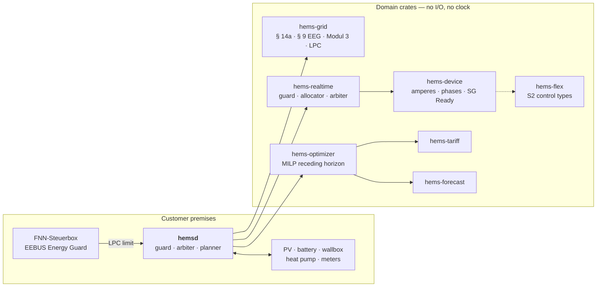

<h1 align="center">⚡ hems</h1>

<p align="center">
  <strong>The open-source home energy management platform for the German market.</strong><br>
  Grid rules that are executable and cited. A guard the optimiser cannot argue with. Everything sans-I/O.
</p>

<p align="center">
  <a href="https://github.com/hupe1980/hems/actions/workflows/ci.yml"></a>
  <a href="#-licence"></a>
  
  
</p>

---

> 🚧 **Pre-alpha.** The control stack is real, tested and simulated end to end.
> The protocol drivers are not written yet — see [Status](#-status).

A household with a roof, a battery, a car, a heat pump and a hot-water tank is
now a small power station with legal obligations. Since 2024 the network operator
may turn its controllable devices down (§ 14a EnWG); since 2025 new photovoltaics
may feed in only 60 % of their installed power until an intelligent meter arrives
(§ 9 EEG), every supplier has to offer a tariff that changes every quarter hour
(§ 41a EnWG), and nothing is earned while the price is negative (§ 51 EEG); from
2026 storage has to account for where its energy came from (MiSpeL) and
neighbours may share electricity (§ 42c EnWG).

**hems is the energy manager that treats those as computation rather than
paperwork.** Every rule names the document it comes from, is executable, and is
tested against the worked examples in that document.

## 💡 Six things that make it different

### 1. The grid limit is a proven property, not a code path

`[BK6-22-300 Anlage 1 Ziff. 4.6 S. 3]` requires that a network operator's
reduction beats market-driven control. In hems that is a **guard plane** the
optimiser cannot reach around: every layer may only *narrow* an interval, and
the guard narrows last.

```rust
// From crates/hems-realtime — a 1000-round property test over random
// households, measurements, plans and user overrides:
assert!(netzwirksam <= ceiling, "the § 14a promise, checked not asserted");
```

The same mechanism carries every other limit that is **shared** rather than
per-device: the main fuse, each sub-distribution board, and the 4,6 kVA of
unbalanced load VDE-AR-N 4100 allows. Bounding each asset by the connection *on
its own* is the mistake that looks right — 11 kW of wallbox, 8 kW of heat pump
and 5 kW of battery each fit under a 24 kW connection, and burn it together.

And a device the drivers cannot hear from is assumed to be drawing its nameplate
power, never nothing. Assuming nothing is how a manager hands away a budget it
has already spent.

A limit is measured where the rule measures it. § 14a limits the
**netzwirksamer Leistungsbezug** — what the controllable devices draw *from the
grid* — so a battery discharging into the wallbox is headroom the household owns
and the Festlegung allows, and the guard lends it as far as the store can
sustain, pinning the lender so the same tick cannot turn it back into a load. § 9
EEG limits what leaves the **connection point**, so a house using 4 kW may
produce 4 kW above the cap. Applying either of them per device — which is the
obvious implementation and was ours — curtails a roof that was inside the law and
leaves a car short on the one evening a battery exists for.

### 2. Every cost is in the objective — and in the number you are shown

A cost-only planner cycles a battery for a spread that does not cover the
damage. Measured, the hidden degradation can exceed the energy saving by an
order of magnitude ([arXiv 2606.16051](https://arxiv.org/abs/2606.16051)). hems
prices throughput in euros per kilowatt-hour and shows you the difference:

```console
$ just demo-all
  ── the same winter day with battery wear priced at zero ──
```

Comfort, curtailment, carbon and self-sufficiency are priced the same way — as
what the household is willing to pay to avoid one unit of each — so the terms
can honestly be added up. An objective that swapped the energy price for grams of
CO₂ while leaving wear in euros would be minimising a sum of two currencies.

The same terms come back out in the **reported** saving, for the plan and for the
baseline alike. Comparing electricity bills alone puts the saving back exactly
where the wear term exists to stop it being: on the reference winter day that is
€3,42 of bill against €2,23 of actual saving. The larger number is the one every
other system quotes.

The ledger is closed on the stores too. A day that ends with an emptier battery
than it began with has spent something it started with, and that is charged — the
opposite case, ending with more, is deliberately *not* credited, because the
baseline has no battery to store anything in and could never earn it. A saving
figure may understate itself; it may not flatter itself.

### 3. The forecast is allowed to be wrong

A saving figure is a statement about a **controller**. A controller judged
against a forecast it was handed as fact is not being judged at all — and a
simulator whose forecast *is* the series it is about to run produces an upper
bound no box in a real house can reach.

So the simulator runs a seeded **realisation** — a cloud that passes at 12:19, an
afternoon three kelvin milder than modelled, a shower that ran long, a roof
delivering 92 % of its datasheet — and the planner gets only what a box could
have known: the geometric model corrected by what *this* roof has been
delivering, this household's own load profile by day type, its own charging
sessions by weekday. The day still replays to the last cent; the planner has to
be wrong about it first.

What that costs is the most useful number the simulator produces:

| Day | Saved | Saved, knowing the future | Premium |
|---|---|---|---|
| January, § 14a reduction, car to charge | **€2,23** | €5,52 | 60 % |
| January evening, car arrives *as* the reduction starts | **€3,06** | €7,09 | 57 % |
| June, more sun than the house can use | **€8,80** | €9,07 | 3 % |
| May, § 9 EEG cap | **€1,11** | €1,10 | — |

```console
$ cargo run -p hemsd -- simulate --day winter --perfect-foresight
```

The shape is the result: where surplus lasts all day the plan has slack and being
wrong costs nothing; where a 20 kWh charging session has to be placed into the
cheap hours *around* a reduction, more than half the headline saving was
foresight. A HEMS quoting a saving without saying which of the two it measured is
quoting the second.

The box scores its own forecasts as it runs — pinball, coverage, bias, CRPS — and
prints them beside the saving.

### 4. A kilowatt-hour has a price, and it is different for each device

"A reduction takes power from where it is worth least" needs a value **per
device**. One marginal value per slot is the same number for everything in it and
ranks nothing.

The plan carries the **shadow price of each store's own state equation**: what
the household loses if *this* device is held back, with the departure time, the
comfort band, the wear and the reduction that will bind at teatime already in it.
A mixed-integer program has no duals, so the model is solved a second time with
the discrete decisions pinned — and that pass always runs on
[Clarabel](https://clarabel.org), which is pure Rust. No C++ toolchain, and **no
backend split**: a box built with the pure-Rust solver and one built with HiGHS
agree about what a kilowatt-hour is worth.

The same pass prices the § 14a ceiling itself:

```console
  relief from § 14a was worth            3.93 €/kWh
```

What a kilowatt-hour of relief from a network operator's limit is worth to *this*
household, from its own plan. €3,93/kWh in a house with no store whose car will
otherwise leave short; €0,16 on the same evening with a battery, because the
store lends the controllable devices the headroom `[A1 2.3]` allows. Aggregators
price both at "30 % of nominal". It is what a § 41e offer or an OpenADR bid
should be built from.

One limitation, measured rather than assumed: on the reference household the
weights change no day's outcome, because the planner has usually already solved
the split, the charge point's indivisible 6 A minimum eats most of a 4,2 kW
budget, and the hardware quantises the rest. `--uniform-weights` is the
comparison and it prints the same numbers.

### 5. It runs the house when the cloud is gone

Guard, arbiter, planner, solar geometry and the price stack are all sans-I/O and
have no clock: time is a parameter. A January day with a § 14a reduction, a
Steuerbox that stops talking and a car that has to be full by seven is a **unit
test that runs in milliseconds**.

And when there is no plan at all — a cold start, a stale plan, a solver that
timed out — the arbiter does what every home battery has always done: covers the
house from the roof and the store rather than from the grid, in both directions.
`just demo offline` runs a whole June day that way: **100 % self-sufficiency,
3,0 kWh imported, no planner at all.**

Which is not the same as holding everything at zero. A device an energy manager
can only *limit* — an inverter, a heat pump, a hot-water tank — has controls of
its own, so an absent instruction means "no limit", not "off". Reading it as
"off", which is right for a battery and a charge point, lets the house go cold
and hands out cold showers, while reporting a saving for both: energy nobody used
is energy nobody bought.

When there *is* a plan, it follows the plan's **energy** rather than its
setpoint: "put 2,4 kWh into the battery during this quarter hour" survives a
cloud at 12:19 and three minutes lost to a network operator's reduction; "charge
at 9,6 kW" survives neither. And the plan has to be *younger* than the arbiter's
tolerance for one: thirty-minute re-planning against a twenty-minute tolerance is
ten minutes in every thirty spent quietly on the fallback, nothing fails, and the
day costs €1,50 more.

And where a rule belongs to a sibling crate, hems **calls it** rather than
keeping a second copy. `P_min,14a`, the netzwirksamer Leistungsbezug, the
Modul 3 calendar and its validation, the 4,6 kVA Unsymmetrieleistung and the
allocation identity § 42b and § 42c settle on all live in
[`metering`](https://github.com/hupe1980/metering), which owns *quantities* where
hems owns *control*. Two enumerations of one regulation are two things that can
disagree about it.

### 6. Compliance is arithmetic, and it is written down

`hems-grid` carries the two rule sets nobody else implements. **MiSpeL**
(BK 618-25-02, in force 01.10.2026) separates which kilowatt-hour through a
battery was green and which was grey — the Abgrenzungsoption's formulas (1)–(33)
and the Pauschaloption's (P1)–(P15), in exact decimals, each numbered as the
Festlegung numbers it. **§ 42c** energy sharing allocates a community's
generation over its members quarter by quarter, capping each at what they
actually used and cascading the remainder rather than stranding it on whoever
happened to be away.

The simulated day feeds its own quarter-hour meter registers straight into the
MiSpeL bookkeeping, which is the integration that would otherwise never be made:
a manager that decides when to charge from the grid but cannot say afterwards how
much of its feed-in was grey has done half the job.

**§ 9 EEG** is the same discipline applied to a rule everybody has heard of. A
system commissioned from 25.02.2025 between 2 and 100 kWp may feed in 60 % of its
installed direct-current power until an intelligent metering system with a
control device is *in operation* — a technical fact, not a signed contract, and
the difference is a type rather than a comment.

`just demo capped` runs a clear **May** day on a 20 kWp roof — May, not June,
because the cap is a fraction of *direct-current* power and what a roof delivers
against it is decided by cell temperature — and prints the quarter-hour feed-in
peak against the ceiling. The cap binds, for four quarter hours around solar
noon, and what it costs is **0,4 kWh**.

That is far less than "60 %" sounds, and the arithmetic is worth stating plainly
because nobody else does: a German roof's clear-day peak is only about two thirds
of its direct-current rating once system losses, soiling and a 50 °C cell are
taken off, so a 60 % line clips the top tenth of the peak on the clearest days of
the year — and a household with a store, a tank and a heat pump **absorbs** most
of that rather than throwing it away. The earlier figure of 3,0 kWh in this
README came from a June day, a planner with perfect foresight and a roof that had
never been told it was dirty. All three flattered it.

## 🏠 One day, end to end

```console
$ cargo run -p hemsd -- simulate --day winter

  2026-01-15 — with a § 14a reduction

  produced                                  8.4 kWh
  household consumption                    11.0 kWh
  charged into the car                     21.7 kWh
  heat pump                                26.2 kWh
  hot water                                 3.1 kWh
  battery throughput                       15.4 kWh
  imported                                 54.4 kWh
  exported                                  0.3 kWh
  curtailed                                 0.0 kWh
  peak feed-in, per quarter hour      0.12 of 5.88 kW
  self-sufficiency                             13 %
  wallbox on one conductor           0 min (0 switches)

  indoor temperature                 19.9 – 23.1 °C
  outside the comfort band                 0.15 K·h
  hot-water tank, emptiest                21 % full

  roof, as the box learned it        90 % of the model
  production forecast, CRPS          65 W (93 % covered)
  load forecast, CRPS                18 W (85 % covered)

  electricity bill                          20.47 €
  battery life spent                         0.63 €
  comfort given up                           0.22 €
  borrowed from the stores                   0.19 €
  cost of the day                           21.51 €
  without optimisation                      23.74 €
  saved                                      2.23 €
  …of it on the bill                         3.42 €

  § 14a limit in force                       90 min
  …covered by the store                     1.5 kWh
  control events recorded            1 (93 samples)
  self-restraint records                          1
  slowest reaction                   0 s, commanded
  minutes without a plan                          0
  without an Energy Guard                     3 min
  limit respected throughout                    yes

  described in S2                       5 resources
  dearest asset vs cheapest                      2×
  relief from § 14a was worth            0.16 €/kWh
  Modul 2 pays above                     2417 kWh/a
  …on this day it would have         -3.90 € on the energy
```

The baseline is the same day delivering the **same service** — the car still
reaches its target, the house is still warm and the shower is still hot — with no
battery, a wallbox that starts on plug-in, and a heat pump and a tank on ordinary
thermostats. It also faces the **same weather**, down to the cloud at 12:19: a
baseline run against a different realisation prices two different Tuesdays and
calls the difference a saving.

"…covered by the store" is `[A1 2.3]` in one number: the kilowatt-hours the
battery lent the controllable devices during the reduction, which never crossed
the connection point and which the Festlegung therefore does not count.

The three forecast lines are the evidence for the three money lines. **"90 % of
the model"** is the box having found, from six weeks of its own metering, that
this roof delivers a tenth less than its geometry says — nothing told it, and a
figure sitting at exactly 100 % would mean the corrector was not being fed.
**CRPS** is the standard probabilistic-forecast score, in watts, so it can be put
beside a published one; the percentage beside it is how often the outcome landed
inside the 10–90 band, which should be near 80. A day that scored zero is a day
the planner was told the answer.

Note the last block before them. Ninety minutes is the network operator's
reduction; the three minutes without an Energy Guard are the manager restraining
*itself* while it waits to find out whether anything is controlling it
(`[LPC-901]`). Both produce a record and both are kept, but they are counted
apart — reporting the second as a § 14a event tells a household the operator
intervened on a day when nobody did. "Slowest reaction" says whether the
household had to be *commanded* into the reduction or was **already below** it:
both satisfy `[A1 4.2]`, and a record that cannot tell them apart reports a
compliant quiet house as one that took eight minutes to react. And "minutes
without a plan" has to be zero:
the arbiter drops a plan older than its tolerance, so a planner that re-solves
more slowly than that leaves the house on the fallback for part of every cycle,
silently.

`just demo-all` runs six days and five comparisons:

| `just demo …` | What it shows |
|---|---|
| `winter` | a § 14a reduction at teatime and a car that must be full by seven |
| `summer` | more production than the house can use, and four negative quarter hours |
| `deadline` | a car that arrives **as the reduction starts** and takes 12 kWh under a 4,2 kW ceiling it shares with a heat pump — the store lends it 6,6 kWh |
| `shared` | the same evening on a household with **no store**, with the reduction arriving at **17:07** rather than on the re-planning grid — the only case where the guard, not the planner, decides who gets it |
| `offline` | **the planner switched off** — the box on its own, and the only day a switchable wallbox pays for itself |
| `capped` | a clear May day on a 20 kWp roof against the § 9 EEG 60 % cap |

and beside them, five comparisons that each isolate one mechanism:

| Flag | What it isolates |
|---|---|
| `--perfect-foresight` | the winter day with the future known in advance: €5,52 against €2,23 — what a saving quoted without a forecast measures |
| `--wear-eur-per-kwh 0` | 18,5 kWh of battery throughput instead of 15,4, for €0,37 more saving on paper and none in the cell |
| `--no-phase-switching` | a fixed three-phase wallbox exports 5,5 kWh where a switchable one puts 31,0 kWh into the car instead of 28,5 |
| `--imsys` | what a Steuerbox is worth to a roof that has not been given one |
| `--uniform-weights` | every asset weighted the same, which is what one marginal value per slot amounts to |

## 🧱 Architecture



Three control planes, at three cadences, with a fixed order of authority:

| Plane | Cadence | Authority | Crate |
|---|---|---|---|
| **Guard** | every tick | absolute — `[A1 4.6]` | `hems-grid` + `hems-realtime::guard` |
| **Arbiter** | ~1 s | inside the guard's bounds | `hems-realtime::arbiter` |
| **Planner** | 15-min slots, re-planned every 15 min or on event | advisory | `hems-optimizer` |

## 📦 Crates

| Crate | What it is | I/O |
|---|---|---|
| [`hems-core`](crates/hems-core) | Domain model: one sign convention, the quarter-hour grid, assets, circuits, setpoints that must name a reason, the building as an exactly discretised RC model, the hot-water tank as a store | none |
| [`hems-grid`](crates/hems-grid) | § 14a EnWG, the EEBUS LPC/LPP state machine, § 9 EEG, Modul 3, MiSpeL flow bookkeeping, § 42c sharing, the two-year evidence record — all cited, and the ones `metering` owns are called rather than copied | none |
| [`hems-tariff`](crates/hems-tariff) | The price stack; parsers for what ENTSO-E, SMARD, aWATTar, Tibber and Energy-Charts publish; an advisor that compares Modul 1/2/3 against a household's own history | none |
| [`hems-forecast`](crates/hems-forecast) | Solar geometry and a physical photovoltaic model, an online residual corrector that learns what *this* roof delivers, load profiles by day type, charging-session statistics by weekday, RC identification of the building from its own record, naive fallbacks, and the metrics that score all of it | none |
| [`hems-optimizer`](crates/hems-optimizer) | Receding-horizon MILP: cost, wear, comfort, hot water, grid limits per slot as hard constraints | none |
| [`hems-realtime`](crates/hems-realtime) | The guard plane, fair allocation of a limited budget, the one-second arbiter | none |
| [`hems-device`](crates/hems-device) | What a wanted power becomes on real hardware: amperes, phase counts, SG Ready contacts | none |
| [`hems-flex`](crates/hems-flex) | The household's flexibility in S2 (EN 50491-12-2): which control type each asset is, and what an instruction means | none |
| [`hems-sim`](crates/hems-sim) | Battery, charge point, inverter, building, hot-water tank and Steuerbox simulators on virtual time — each with at least one way of saying no — and a seeded weather realisation, so the day that happens is not the day that was forecast | none |
| [`hems-events`](crates/hems-events) | The CloudEvents catalogue, enforced by a workspace guard | none |
| [`hemsd`](services/hemsd) | The edge daemon | tokio |

## 📐 What the rules are taken from

Every regulatory number in the code carries the document and clause it comes
from, in a doc comment: `[BK6-22-300 A1 4.5.2]`, `[LPC-031]`. `cargo xtask
check-citations` resolves all 244 of them against an index of primary sources and
**fails the build** if one names a document the index does not carry. A rule
without a citation does not compile.

| Rule | Source |
|---|---|
| Which devices are controllable, and the per-Fallgruppe summation | BK6-22-300 Anlage 1 Ziff. 2.4 |
| The minimum power a network operator may not go below, and the Gleichzeitigkeitsfaktor table | Ziff. 4.5 |
| Netzwirksamer Leistungsbezug — why photovoltaic surplus lifts the ceiling | Ziff. 2.3 |
| Transitional regimes to 2028 | Ziff. 10 |
| The five-state limitation machine: heartbeat 60 s, failsafe after 120 s, release after 2–24 h | EEBUS LPC TS §§ 2.2–2.3 |
| The 60 % feed-in cap, what lifts it, and the EEBUS feed-in factor | § 9 Abs. 1–2 EEG (Solarspitzengesetz), `[MGCP-011]` |
| HT/NT/ST windows and their validity rules | BDEW AWH Modul 3 V1.1 |
| Which kilowatt-hour through a battery was green | MiSpeL Anlage 1 formulas (1)–(33), Anlage 2 (P1)–(P15) |
| Allocating a community's generation quarter by quarter | § 42c EnWG Abs. 1, 3, 4 |

## 🚀 Getting started

```console
$ git clone https://github.com/hupe1980/hems && cd hems
$ just ci          # fmt, clippy, purity, tests, guards, licences, docs
$ just demo-all    # six days end to end, and five comparisons worth seeing
```

Released builds of the daemon are on the
[releases page](https://github.com/hupe1980/hems/releases) for
`x86_64-unknown-linux-gnu` and `aarch64-unknown-linux-gnu`, each built natively,
smoke-tested against a simulated day before it ships, and accompanied by a
CycloneDX SBOM, `SHA256SUMS` and a signed build-provenance attestation:

```console
$ gh attestation verify hemsd-*.tar.gz --repo hupe1980/hems
```

The binary also carries its own dependency list (`cargo auditable`), so
`cargo audit bin hemsd` answers "what is in this thing" from an artefact found in
the field rather than from a file shipped beside it.

Or use a crate on its own — they are independent and none of them does any I/O:

```rust
use hems_grid::para14a::{ControlMode, SteuVe, minimum_power};
use hems_core::prelude::{AssetId, Fallgruppe, Power};

let devices = [
    SteuVe { assets: vec![AssetId::new("wallbox")?], fallgruppe: Fallgruppe::Ladepunkt,     power: Power::from_kw(11.0) },
    SteuVe { assets: vec![AssetId::new("battery")?], fallgruppe: Fallgruppe::Stromspeicher, power: Power::from_kw(5.0)  },
];

// 4,2 kW + (2 − 1) × 0,8 × 4,2 kW = 7,56 kW — the floor the network operator
// may not go below, from [BK6-22-300 A1 4.5.2].
assert!((minimum_power(&devices, ControlMode::Ems).kw() - 7.56).abs() < 1e-9);
# Ok::<(), Box<dyn std::error::Error>>(())
```

## 📊 Status

| Milestone | State |
|---|---|
| **M1** domain, grid rules, tariffs, forecasts | ✅ done |
| **M2** guard, allocator, arbiter | ✅ done |
| **M3** MILP planner with wear and grid limits | ✅ done |
| **M3.5** simulators and end-to-end days | ✅ done |
| **M3.6** device commands (amperes, phases, SG Ready) and the S2 flexibility model | ✅ done |
| **M3.7** shared limits (connection, sub-circuits, Schieflast), storage bounds in the guard, semi-continuous charging | ✅ done |
| **M3.8** MiSpeL bookkeeping and § 42c allocation, exact RC discretisation, the plan as an energy commitment | ✅ done |
| **M3.9** 1p/3p phase switching end to end; the planning cadence; a soft charging deadline | ✅ done |
| **M3.10** § 9 EEG wired end to end, per-slot grid limits, the store lending § 14a headroom, hot water as a second store, an inverter that answers curtailment | ✅ done |
| **M3.11** the § 14a, Modul 3, Schieflast and allocation arithmetic delegated to `metering` 0.21; a Modul 3 calendar that knows a Sunday; the Verursachungsregel and the Aufteilungsschlüssel as choices rather than assumptions | ✅ done |
| **M3.12** the end of perfect foresight — a seeded weather realisation, forecasts the box has to *learn*, the price-source parsers, § 42c and the S2 model given callers, and every day scored against what it actually predicted | ✅ done |
| **M3.13** per-asset shadow prices from a pinned-binary dual pass on Clarabel, the § 14a ceiling priced as flexibility, and a reduction that arrives off the re-planning grid | ✅ done |
| **M4** a driver trait and the first real driver: Modbus/SunSpec | ⏳ next |
| **M5** EEBUS (SHIP/SPINE, LPC/LPP/MPC/MGCP), OCPP, SG Ready, SMGW | ⏳ blocked on the [`eebus`](https://github.com/hupe1980/eebus) crate |
| **M6** fleet services, market bridge to `mako` | 📋 planned |

Nothing here talks to hardware yet: `hems-sim` stands in for every device, and
the drivers are M4/M5. What is real is the control stack and the rules, and they
are real all the way down — the simulated days run the same guard, arbiter and
planner a box would.

442 tests. `just ci` runs formatting, Clippy with warnings as errors on every
feature combination, a purity check that fails if a domain crate reaches for a
clock, the whole suite, the workspace guards (244 citations across five document
families, each resolving to a document the index carries), `cargo-deny` and the
docs.

Three of them are worth naming because of what they guard against. One asserts
the reference day's forecasts were **wrong**, since a day the planner cannot be
surprised by measures a planner that was shown the answer. One runs the day's own
quarter-hour registers through the § 42c allocation. One checks that every asset
the arbiter commands can be described in S2. A rule module can be implemented,
cited, tested and reached by nothing at all, and no property test catches that —
a property is a statement about code that runs.

## 🤝 Related crates

hems consumes rather than reimplements: [`s2energy`](https://crates.io/crates/s2energy)
(the S2 / EN 50491-12-2 types, generated from the official schema by the
standard's own authors), [`metering`](https://github.com/hupe1980/metering)
(Europe/Berlin calendar, OBIS, § 14a minimum power and netzwirksamer
Leistungsbezug, Modul 3 calendars and their conformance rules, the VDE-AR-N 4100
Unsymmetrieleistung, the allocation identity § 42b/c settle on), [`eebus`](https://github.com/hupe1980/eebus),
[`ocpp-kit`](https://github.com/hupe1980/ocpp-kit), [`iso15118`](https://github.com/hupe1980/iso15118)
and [`mako`](https://github.com/hupe1980/mako) (the market side).

The embedded time-series store on the box and the fleet-side one are separate
crates that are not published yet; hems does not depend on either today, because
`hemsd` has no persistence at all (see [Status](#-status)).

## 📄 Licence

MIT OR Apache-2.0, at your option.

hems is not affiliated with the Bundesnetzagentur, the BDEW, the EEBus Initiative
or the VDE. Regulatory documents are cited, never redistributed.
