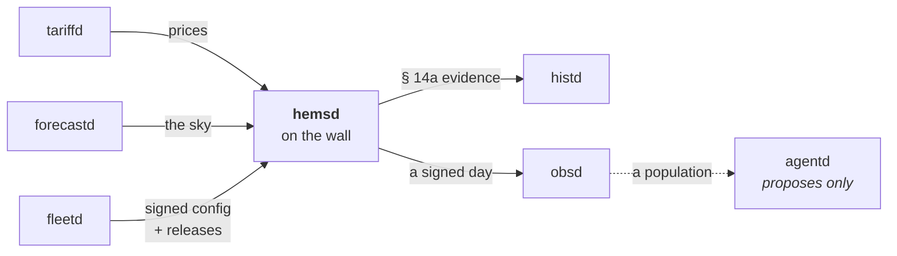

<h1 align="center">⚡ hems</h1>

<p align="center">
  <strong>The open-source home energy management platform for the German market.</strong><br>
  Grid rules that are executable and cited. A guard the optimiser cannot argue with. Everything sans-I/O.
</p>

<p align="center">
  <a href="https://hupe1980.github.io/hems"></a>
  <a href="https://github.com/hupe1980/hems/actions/workflows/ci.yml"></a>
  <a href="#-licence"></a>
  
  
</p>

---

> 🚧 **Pre-alpha.** The control stack is real, tested and simulated end to end.
> `hemsd run` opens real sockets to real devices, accepts a network operator's
> Steuerbox over TLS, and plans against fetched prices and a fetched sky. The
> plan reaches the battery, the hot-water tank, the car and the building. What
> is missing is the market side and certification. See [Status](#-status).

A household with a roof, a battery, a car, a heat pump and a hot-water tank is
now a small power station with legal obligations. Since 2024 the network operator
may turn its controllable devices down (§ 14a EnWG); since 2025 new photovoltaics
may feed in only 60 % of their installed power until an intelligent meter arrives
(§ 9 EEG), every supplier has to offer a tariff that changes every quarter hour
(§ 41a EnWG), and — once the smart meter has been in a year — nothing is earned
while the price is negative (§ 51 EEG); from 2026 storage has to account for
where its energy came from (MiSpeL) and neighbours may share electricity
(§ 42c EnWG).

**hems is the energy manager that treats those as computation rather than
paperwork.** Every rule names the document it comes from, is executable, and is
tested against the worked examples in that document.

## 📚 Documentation

The full argument lives at **[hupe1980.github.io/hems](https://hupe1980.github.io/hems)**.
This file is the front door.

| | |
|---|---|
| [Getting started](https://hupe1980.github.io/hems/docs/getting-started/) | clone it, run the checks, watch a January day with a § 14a reduction |
| [Architecture](https://hupe1980.github.io/hems/docs/architecture/) | three control planes, three cadences, one order of authority |
| [The domain model](https://hupe1980.github.io/hems/docs/domain-model/) | one sign convention, the quarter-hour grid, the electrical tree, commands that name a reason |
| [The grid rules](https://hupe1980.github.io/hems/docs/grid-rules/) | § 14a, § 9 EEG, Modul 3, MiSpeL, § 42c — as code, with the citation for every number |
| [Tariffs and prices](https://hupe1980.github.io/hems/docs/tariffs/) | the bill as a stack, the five day-ahead sources, § 51 EEG, the grid's carbon intensity, the Modul advisor |
| [The planner](https://hupe1980.github.io/hems/docs/optimizer/) | the receding-horizon MILP, and what a kilowatt-hour is worth per device |
| [Forecasting](https://hupe1980.github.io/hems/docs/forecasting/) | what the box believes about tomorrow, and what being wrong costs |
| [Flexibility](https://hupe1980.github.io/hems/docs/flexibility/) | S2 / EN 50491-12-2 as the internal model |
| [Devices and drivers](https://hupe1980.github.io/hems/docs/devices/) | amperes, contact states, contactors — and the sans-I/O driver contract |
| [Simulation](https://hupe1980.github.io/hems/docs/simulation/) | seven reference days, simulators that say no, and the sweeps a single day cannot replace |
| [The fleet](https://hupe1980.github.io/hems/docs/services/) | six daemons around one box, and why none of them is a trust anchor |
| [Agents](https://hupe1980.github.io/hems/docs/agents/) | the read-only surface every fleet service answers on, and a plane that proposes and cannot act |
| [Security](https://hupe1980.github.io/hems/docs/security/) | capabilities that narrow under delegation, a key the box was built with, secrets as references, SBOM and provenance |

## 🚀 Try it

```console
$ git clone https://github.com/hupe1980/hems && cd hems
$ just demo-all    # seven simulated days end to end, and the comparisons worth seeing
$ just ci          # fmt, clippy, purity, tests, guards, licences, docs
$ just fleet-demo  # a box reporting its day into the fleet view
```

And to manage a real house, from a file that describes it:

```console
$ cargo run -p hemsd -- run --check --config services/hemsd/hemsd.example.toml
✅ 8 assets, 3 drivers, 6 resources described in S2

$ cargo run -p hemsd -- run --config /etc/hems/hemsd.toml
```

Each of the seven daemons ships an annotated `<name>.example.toml` beside its
source — parsed by a test, so an example that has drifted from the struct it
documents fails the build rather than misleading whoever is deploying it.

`--check` builds the site and the drivers and stops before opening a socket — the
command an installer runs before leaving the cellar. It refuses a driver for an
asset the site does not have, two drivers that both command or both measure one
asset, a controllable device no driver can command, a § 14a household with nothing that could hear a
reduction, a **Modul 3 calendar the household may not be billed on** — the
one thing in the file that is transcribed by hand from a PDF, checked against
the seven rules of the BDEW Anwendungshilfe — a market identifier that fails its
own check digit, a thermal model no house could have, and a § 14a regime declared
for a device this household does not own. Each of those is silent at runtime
and loud at start-up, which is the right way round.

It also **says what the paperwork produced**, because the consequence of a date
is not obvious from the date:

```console
INFO § 14a asset=waermepumpe commissioned=Some(2019-04-01) participation=Legacy { until: 2028-12-31 } controlled=false
INFO § 9 EEG: no statutory feed-in cap applies to this roof commissioned=Some(2024-06-01)
```

A roof commissioned in the window § 100 Abs. 3b EEG exempts is capped at
*nothing*, and a box that assumed otherwise would curtail it at 60 % every sunny
midday for the life of the installation. A 2019 heat pump on the old reduced
network fee is on `[A1 10.1]` until 2028, and counting it as a new SteuVE hands
the network operator a share of its power it may not reduce. Neither is derivable
from a nameplate, both take ten seconds to declare, and the installer standing in
front of the box is the only person who can correct them.

Rust 1.94 and [`just`](https://just.systems) to build and run. The default solver
is pure Rust, so there is no C++ toolchain and no system library to install.

`just test` additionally needs a **container runtime** (Docker, Podman or
Colima). The fleet daemons deploy on PostgreSQL, so their queries are tested
against PostgreSQL — a service checked on a different engine is a service whose
SQL is checked by nothing. The suite starts **one** container for the whole
workspace and gives each test a database of its own; `just db-stop` is the
teardown. `HEMS_TEST_POSTGRES` points it at a server already running instead;
there is deliberately no way to skip, because a test that passed without reaching
a database would report green for a query nobody ran.

Released builds are on the
[releases page](https://github.com/hupe1980/hems/releases) for
`x86_64-unknown-linux-gnu` and `aarch64-unknown-linux-gnu`, each built natively,
smoke-tested against a simulated day before it ships, and accompanied by a
CycloneDX SBOM, `SHA256SUMS` and a signed build-provenance attestation
(`gh attestation verify hemsd-*.tar.gz --repo hupe1980/hems`). The binary carries
its own dependency list (`cargo auditable`), so `cargo audit bin hemsd` answers
"what is in this thing" from an artefact found in the field.

Or use a crate on its own — they are independent and none of them does any I/O:

```rust
use hems_grid::para14a::{ControlMode, SteuVe, minimum_power};
use hems_core::prelude::{AssetId, Fallgruppe, Power};

let devices = [
    SteuVe { assets: vec![AssetId::new("wallbox")?], fallgruppe: Fallgruppe::Ladepunkt,     power: Power::from_kw(11.0) },
    SteuVe { assets: vec![AssetId::new("battery")?], fallgruppe: Fallgruppe::Stromspeicher, power: Power::from_kw(5.0)  },
];

// 4,2 kW + (2 − 1) × 0,8 × 4,2 kW = 7,56 kW — the floor the network operator
// may not go below, from [BK6-22-300 A1 4.5.2].
assert!((minimum_power(&devices, ControlMode::Ems).kw() - 7.56).abs() < 1e-9);
# Ok::<(), Box<dyn std::error::Error>>(())
```

## 🧭 How it is arranged


Every layer may only **narrow** what the layer above allowed, so “the grid limit
was respected” is a property of the structure rather than a code path somebody
remembered to write — and it is checked as one, over a thousand randomised
households.

## 🏠 One day, end to end

```console
$ cargo run -p hemsd -- simulate --day winter


  2026-01-15 — with a § 14a reduction

  produced                                  7.4 kWh
  household consumption                    11.0 kWh
  charged into the car                     21.7 kWh
  heat pump                                22.1 kWh
  hot water                                 3.1 kWh
  dishwasher                  1.1 kWh, 75 min later
  battery throughput                       15.6 kWh
  imported                                 52.9 kWh
  exported                                  0.3 kWh
  curtailed                                 0.0 kWh
  peak feed-in, per quarter hour    0.12 of 5.88 kW
  self-sufficiency                             12 %
  wallbox on one conductor       0 min (0 switches)

  indoor temperature                 19.9 – 23.0 °C
  outside the comfort band                 0.15 K·h
  hot-water tank, emptiest                25 % full

  roof, as the box learned it     90 % of the model
  roof, is it still the roof it was  yes, 91 % of 89 %
  production forecast, CRPS  173 W (83 % of 30 lit)
  load forecast, CRPS           18 W (85 % covered)

  electricity bill                          19.97 €
  …if the quarter hour were netted  +0.01 € on the bill saving, which a two-register meter does not forgive
  battery life spent                         0.63 €
  comfort given up                           0.22 €
  borrowed from the stores                   0.08 €
  cost of the day                           20.90 €
  without optimisation                      21.96 €
  saved                                      1.07 €
  …of it on the bill                         0.63 €

  § 14a limit in force                       90 min
  …against a minimum of                     10.5 kW
  …covered by the store                     1.4 kWh
  control events recorded            1 (92 samples)
  self-restraint records                          1
  slowest reaction                   0 s, commanded
  minutes without a plan                          0
  commands the hardware clipped  0 ticks (0.00 kWh)
  quarter hours § 51 EEG zeroed                   0
  carbon behind the imports     17.3 kg (327 g/kWh)
  the opening plan expected   19.06 €, off by +0.91
  without an Energy Guard                     2 min
  § 14a limit respected                         yes
  § 9 EEG ceiling respected                     yes

  described in S2                       6 resources
  dearest asset vs cheapest                      1×
  relief from § 14a was worth            0.00 €/kWh
  Modul 2 pays above                     2417 kWh/a
  …on this day it would have  -3.77 € on the energy

```

Five lines there are not in anybody else's table, and the
[planner page](https://hupe1980.github.io/hems/docs/optimizer/) argues each:

- **without optimisation** — the same day delivering the **same service** with the
  **same equipment**: the same battery on the greedy self-consumption rule every
  hybrid inverter ships with, a wallbox that starts on plug-in, ordinary
  thermostats, the same weather and the same grid rules. The battery matters most:
  a store earns the import/export spread on everything it cycles whether or not
  anybody is optimising, so a saving measured against an *idle* one is the value
  of owning a battery rather than of managing one (D195).
- **saved / …of it on the bill** — €1,08 against €0,74. The saving counts the
  battery life, the comfort and the service the plan spent; the bill is the
  flattering number every other system quotes. Here the bill saving is the
  *smaller* of the two, because the factory controller cycles the pack harder and
  lets the house drift further than the plan does.
- **…if the quarter hour were netted** — how the bill is *accumulated* moves the
  saving, and nobody publishes their convention. A two-register meter does not
  net: a quarter hour with seven minutes of import and seven of export registers
  both, and is billed for both at two different prices. hems accumulates tick by
  tick with the directions priced apart, on both sides of the comparison. On this
  day it is worth under a cent — and that is itself a finding, because against a
  batteryless baseline it was worth €0,93. A store absorbs the sub-quarter-hour
  reversals that netting forgives, so a published comparison of netting
  conventions is measuring the baseline's storage as much as the convention.
- **…covered by the store** — `[A1 2.3]` in one number: kilowatt-hours the
  battery lent the controllable devices during the reduction, which never crossed
  the connection point.
- **relief from § 14a was worth** — the shadow price of the network operator's own
  ceiling. Zero here, because the store lends the headroom; €1,20/kWh on the same
  evening in a house without one.
- **§ 14a limit respected / § 9 EEG ceiling respected** — two statutes on one
  connection point, two answers. A limit printed beside its bound is not a limit
  anybody is checking.

The three forecast lines are the evidence for the money lines: the planner is
given only what six weeks of the box's own metering could have taught it.
`--perfect-foresight` runs **the same day** with the planner shown the weather it
will actually get — the unmanaged household comes out identical to the cent,
which is what makes the difference attributable to foresight — and on this
January day that is worth **€0,28 of a €0,57 bill saving**. A saving published
from a perfect-foresight run therefore overstates itself by percent rather than
by half (D197).

## 💡 What makes it different

Eight claims, each argued on the site rather than here.

1. **The grid limit is a proven property, not a code path.** `[A1 4.6 S. 3]`
   requires a network operator's reduction to beat market control, so it lives in
   a guard plane the optimiser cannot reach around — checked by a 1000-round
   property test over random households, not by a code path somebody remembered.
   ([architecture](https://hupe1980.github.io/hems/docs/architecture/))
2. **Every cost the optimiser may spend is a cost the report charges** — battery
   wear, comfort, curtailed production, and the service the plan decided not to
   deliver. A plan that leaves the car two kilowatt-hours short buys two
   kilowatt-hours less electricity, and the bill alone would call that a saving.
   ([planner](https://hupe1980.github.io/hems/docs/optimizer/))
3. **The forecast is allowed to be wrong.** The simulated day runs a seeded
   realisation the planner never sees, and every day scores its own forecasts
   beside the money.
   ([forecasting](https://hupe1980.github.io/hems/docs/forecasting/))
4. **It can plan against a distribution rather than a number** — three futures
   from the published band, the first slot decided once and everything after it
   recourse, with the evaluation that can *falsify* it shipped alongside.
   ([planner](https://hupe1980.github.io/hems/docs/optimizer/))
5. **A kilowatt-hour has a price, and it differs per device.** The plan carries
   the dual of each store's own state equation, so "a reduction takes power from
   where it is worth least" is a decision rather than a sentence.
   ([planner](https://hupe1980.github.io/hems/docs/optimizer/))
6. **It runs the house when the cloud is gone.** Guard, arbiter and planner take
   time as a parameter, so a winter day with a § 14a event is a unit test — and a
   device the manager can only *limit* is handed back to its own thermostat
   rather than held at zero.
   ([architecture](https://hupe1980.github.io/hems/docs/architecture/))
7. **Compliance is arithmetic, and it is written down.** MiSpeL's
   Abgrenzungsoption (1)–(33) and Pauschaloption (P1)–(P15), § 42c's quarter-hourly
   allocation, Modul 3 windows and the two years of § 14a evidence — in exact
   decimals, with the Festlegung's own numbering.
   ([grid rules](https://hupe1980.github.io/hems/docs/grid-rules/))
8. **The household it is compared against owns the same equipment.** The same
   battery, on the greedy self-consumption rule every hybrid inverter ships with;
   the same tank at the same set point; the same community membership; the same
   grid rules. Both households pay their own battery wear, and both can be charged
   for ending the day emptier than they began — a term a comparison against an
   idle store cannot even express (D195).
   ([planner](https://hupe1980.github.io/hems/docs/optimizer/))

## 📐 What the rules are taken from

Every regulatory number carries the document and clause it comes from —
`[BK6-22-300 A1 4.5.2]`, `[LPC-031]` — and `cargo xtask check-citations` resolves
all 461 of them against an index of primary sources, **failing the build** if one
names a document the index does not carry. `cargo xtask check-wire` does the same
for the 130 quantities and instants, each of which has to say how it travels;
`cargo xtask check-vital` for a daemon's background loops, since one spawned
outside `Health::vital` has a liveness probe that cannot fail, which is worse
than none; `cargo xtask check-deps-used` for the 255 declared dependencies,
because every crate here is published and an edge nobody uses is a resolution and
a compile a downstream consumer pays for — and an edge from the simulator to the
forecaster would be a path by which the day that happens could read the day that
was expected; and `cargo xtask check-notes` for the `D`, `R` and `M` labels
below, since a doc comment citing a decision that has been withdrawn leaves a
reader with a code and nothing to resolve it against.

The documents are third-party copyrighted publications and are not redistributed;
the index that records each retrieval URL is a working file and is not part of
the published crates. The citation is the lookup key — `[BK6-22-300 A1 4.5.2]`
names a Beschluss of the Bundesnetzagentur and a clause in its Anlage 1, which is
what a network operator or a certification laboratory would ask for too.

Doc comments also carry **`D`, `R` and `M` labels** — `(D168)`, `(R32)`, `(M8)`.
They point into the architecture notes: the decision log, with the alternative
each decision rejected; the risk register; and the milestones. Those are working
files rather than published documentation, for the same reason a laboratory
notebook is not a manual — they are written to be argued with, and they change
faster than a release. The argument a label refers to is always made in the doc
comment as well, so the label is provenance rather than a dependency: it says
*this was decided, not assumed*, and which sibling decisions it has to stay
consistent with. `cargo xtask check-notes` fails the build where a label resolves
to nothing, which is how a decision withdrawn from the log stops silently
orphaning the code that replaced it.

## 📦 Crates

| Crate | What it is | I/O |
|---|---|---|
| [`hems-core`](crates/hems-core) | Domain model: one sign convention, the quarter-hour grid, assets, circuits, setpoints that must name a reason, the building as an exactly discretised RC model — with the sun through its windows and the household's own waste heat in it, which on a clear March noon is the whole of the heating demand — the hot-water tank as a store, an appliance's programme as the shape it draws — and the types the edge and the fleet exchange, so a renamed field is a compile error rather than a dashboard reading zero | none |
| [`hems-grid`](crates/hems-grid) | § 14a EnWG, the EEBUS LPC/LPP state machine, § 9 EEG, Modul 3, MiSpeL flow bookkeeping, § 42c sharing, the two-year evidence record — all cited, and the ones `metering` owns are called rather than copied | none |
| [`hems-tariff`](crates/hems-tariff) | The price stack; parsers for what ENTSO-E, SMARD, aWATTar, Tibber and Energy-Charts publish; an advisor that compares Modul 1/2/3 against a household's own history | none |
| [`hems-forecast`](crates/hems-forecast) | Solar geometry and a physical photovoltaic model — an Erbs decomposition of the sky into beam and diffuse, an HDKR transposition onto the roof and onto the windows — an online residual corrector that learns what *this* roof delivers, load profiles by day type, charging-session statistics by weekday, identification of the building from its own record (fabric, solar aperture and internal gain), naive fallbacks, and the metrics that score all of it | none |
| [`hems-optimizer`](crates/hems-optimizer) | Receding-horizon MILP: cost, wear, comfort, hot water, shiftable appliances placed rather than smeared, grid limits per slot as hard constraints | none |
| [`hems-realtime`](crates/hems-realtime) | The guard plane, fair allocation of a limited budget, the one-second arbiter | none |
| [`hems-device`](crates/hems-device) | What a wanted power becomes on real hardware: amperes, phase counts, SG Ready contacts — and `realisable`, what a semi-continuous device will *actually* take | none |
| [`hems-drv`](crates/hems-drv) | The driver contract — bytes and a clock in, events and bytes out — with SunSpec over Modbus TCP, the EEBUS LPC/LPP Controllable System, and the MGCP and MDT Monitoring Appliances behind features | none |
| [`hems-flex`](crates/hems-flex) | The household's flexibility in S2 (EN 50491-12-2): which control type each asset is, every description a whole site would send — the same wallbox is a store with a car on it and an envelope without one — what an instruction means, and the sans-I/O **Resource Manager session** that has the conversation | none |
| [`hems-sim`](crates/hems-sim) | Battery, charge point, inverter, building, hot-water tank, a dishwasher that will not be paused, and Steuerbox simulators on virtual time — each with at least one way of saying no — and a seeded weather realisation, so the day that happens is not the day that was forecast | none |
| [`hems-events`](crates/hems-events) | The CloudEvents catalogue, enforced by a workspace guard | none |
| [`hems-service`](crates/hems-service) | The shell every daemon shares: configuration from a file then the environment, a **`Secret`** whose configured value may be an `env:` or `file:` reference rather than the credential itself, **live and ready as separate questions**, a bounded shutdown, Ed25519 verification of a release *and of the box's own configuration* — whose trust anchor is a key the box was built with, not the server that offered it — and the one outbound HTTP client every daemon builds through | tokio, axum, reqwest |

## 🛰️ Daemons



Every arrow into the box carries something that can only make a plan **better**.
The § 14a limit is not among them: it arrives on a wire from the network
operator's Steuerbox, and the guard enforces it locally whether or not any of
this is reachable.

| Service | What it does | State |
|---|---|---|
| [`hemsd`](services/hemsd) | The house: guard, arbiter, planner and evidence recorder against a simulated site, keeping the household's own two years of § 14a evidence locally with an outbox for the fleet | ⏳ no hardware yet |
| [`tariffd`](services/tariffd) | Fetches the five published day-ahead sources, reconciles a curve that arrives twice under a written trust order, and keeps two days each way so a WAN outage never costs a plan | ✅ |
| [`forecastd`](services/forecastd) | ICON-D2 through Open-Meteo at quarter-hour resolution. Serves the **sky**, never a finished forecast — the correction for *this* roof is the box's, because it is a property of one roof | ✅ |
| [`histd`](services/histd) | The fleet's record, in PostgreSQL: the two years of § 14a evidence `[A1 7.3]`, the quarter-hour registers a settlement is computed from as exact `NUMERIC` and **versioned** — a restated register supersedes its predecessor without erasing it, so `?as_of=` reproduces a Nachweis already handed over — and both exports, the operator's Nachweis and the household's Data Act Article 4 document, each authorised per site, because Article 4 is a right of the *user* and a fleet token is not a household | ✅ |
| [`fleetd`](services/fleetd) | Single-use enrolment, and **signed** configuration and releases it holds signatures for and never a key — so a `fleetd` an attacker owns can serve neither a configuration nor an update any box will accept | ✅ |
| [`agentd`](services/agentd) | The advisory plane, on [agentplane](https://github.com/hupe1980/agentplane): specialists that correlate across `obsd`'s exact answers — whether one cause accounts for most of a week's § 14a breaches, whether a roof over its § 9 EEG ceiling is misconfigured or unlucky, what the dashboard's saving figure actually rests on. It **proposes**, and cannot act: `Advice` is a leaf type nothing consumes, no route writes, and an agent's authority is derived by `attenuate`, which refuses to widen | ✅ |
| [`obsd`](services/obsd) | The fleet view: averages what is an average, and **counts** what is a count — every § 14a breach as a named finding, never as a percentage. A day reaches it over TLS and only as a **signed** CloudEvent, because a list of who broke a grid rule that anybody can write to is not evidence | ✅ |

Each of the six mounts a **read-only** MCP server at `/mcp` on the port it
already binds, over the state its REST routes already read — an agent gets the
same numbers and gets told what they mean: that an absent price slot is not free
electricity, that a § 14a breach is a list with a site and a date rather than a
rate, and that a coverage figure under twenty independent days is not a
calibration. Off unless configured, and every tool authorises **the caller that
reached it** against the same credentials the REST routes use.

A principal is a credential (**who**), a set of dotted **capability** patterns
(`hems.record.read`, `hems.record.*`) and a **site scope** (one household, a
tenant, or the explicit `"*"`). Capabilities rather than roles because an agent
must be able to hold *less* than whoever it acts for, and the two pattern forms
are exactly as wide as containment can stay decidable — the same shape
[agentplane](https://github.com/hupe1980/agentplane) uses, since that is the
runtime the advisory agent will run on.

## 📊 Status

**Pre-alpha, and the line is worth being exact about.** `hemsd run` opens real
sockets and plans: a SunSpec inverter on Modbus TCP is read, folded into the
guard's view and commanded; every five minutes the box asks `tariffd` what
electricity costs and `forecastd` what the sky will do, models this roof, applies
the correction the roof has earned from its own meter, reads the battery's charge
and publishes a plan the arbiter follows.

A network operator's Steuerbox reduces it. `hemsd` accepts one over TCP, TLS 1.2
with mutual authentication, a WebSocket upgrade and the SHIP handshake; what
crosses that seam is a SPINE datagram, so a limit an Energy Guard writes becomes
the ceiling the guard enforces, the control loop writes the `[A1 7.2]` record as
the reduction runs, and `histd` gets what it will take.

The plan reaches every store the box can **read**: the battery off its own
meter, the hot-water tank (EEBUS MDT), the car (EEBUS EVCC and EVSOC) and the
building (EEBUS MRT, or a vendor's Modbus register map). Each is a refusal
rather than a default where nothing measured it — a store's state is not a thing
to assume, and every one of these guesses wrong in the expensive direction. An
unmeasured store is left out of the *names* the plan may command too: an asset a
plan names but does not model gets an envelope pinned at zero, and the arbiter
obeys that as an instruction not to use it.

| Works today | |
|---|---|
| The domain model and the German grid rules | § 14a, § 9 EEG, § 51, Modul 3 (transcribed from the operator's price sheet, and the box refuses to start on a calendar that breaks the Anwendungshilfe), MiSpeL, § 42c, the two-year evidence record — all cited |
| The guard, the allocator and the one-second arbiter | with the § 14a precedence as a property test over a thousand randomised households |
| The receding-horizon MILP | wear, comfort, hot water, placed appliances, per-slot grid limits, a shadow price per asset, and planning against three futures |
| Forecasting, and being scored on it | solar geometry, a residual corrector that learns *this* roof, CRPS and calibration beside the money |
| Seven reference days end to end | plus a cold one — a box on its first evening, with no profile and no roof correction — and multi-day back-test and risk sweeps |
| S2 / EN 50491-12-2 as the internal flexibility model **and as a Resource Manager** | every message a whole site would send, a count of what it cannot express, and the handshake-to-instruction session a Customer Energy Manager drives — sans-I/O, so a whole negotiation is a unit test |
| **A Customer Energy Manager can drive this household** — the half of S2 nobody else in the field implements | one WebSocket per resource at `/s2/{asset}`, off by default. An instruction outranks the box's own plan, is outranked by whoever pressed *boost*, and is narrowed by the guard like everything else, so a manager cannot ask its way past a § 14a ceiling. It expires if the manager stops talking, and a guard override is reported back as `ABORTED` — an aggregator holding an `ACCEPTED` it was never told about has sold flexibility the grid took |
| The driver contract, SunSpec over Modbus TCP, and the EEBUS LPC Controllable System | sans-I/O; a whole § 14a day in virtual time, and an Energy Guard writing a limit over SPINE datagrams |
| **The hot-water tank over EEBUS MDT** — the one number that kept the optimiser's hot-water store out of every real plan | a circuit reports 52,5 °C over SPINE and the planner gets a store; a flagged sensor reaches it as an absent tank rather than a number to heat against |
| **The heat pump over EEBUS** — the lever an energy manager never had | OHPCF starts and stops the compressor's process, which is the one use case that can ask an appliance to consume *more*; MRT reports the air temperature of each room it watches and MOT the weather at this building, which are two of the three signals a thermal model is identified from. Three use cases on one session, because SHIP grants one per peer |
| **The hot-water loading over EEBUS CDSF** | the button in the bathroom, pressed over the wire: the shortest path there is from "the roof is exporting" to "the tank is absorbing it", and given back when a cloud arrives. Not a setpoint — a setpoint hands the decision back to the circuit's own controller, which is what an MPC exists to replace |
| **A vendor's own register map over Modbus TCP** | for everything that answers Modbus and publishes no SunSpec model list, which is most of the installed heat-pump base. Space, width, word order, scale and field are declared and none is guessed. It writes only registers a household **declared**, only the values that declaration enumerates, one sixteen-bit register each — so no scale can be got wrong, and a map with no `writes` is read-only |
| **The car over EEBUS EVCC and EVSOC** — an arrival, which has no message: an `EV` entity appearing under the `EVSE` *is* the message | a cable goes in and the plan gets a charging deadline; a car that cannot say how full it is is still a car, and is not charged against an invented battery |
| **Pairing a Steuerbox without a restart** | it dials a box that does not know it, is held pending, is approved mid-handshake, and gets through |
| **The SHIP session** — TLS 1.2 with mutual authentication, the WebSocket upgrade, the handshake, a trust store and a SKI that survive a reboot, and a `_ship._tcp` announcement so a Steuerbox can find the box at all | a Steuerbox reduces a running household to 4,2 kW over a real socket, and an unapproved one completes TLS and gets no further |
| The driver registry | `hemsd` checks the drivers against the site *before* a byte moves |
| **The house in front of the box, described rather than assumed** | the roof's own tilt and azimuth, a thermal archetype for the building and the way its windows face, the commissioning date and legacy regime of every asset, and what the connection agreement says beyond the fuse. Each was a constant standing in for a country, and each decides either a statutory limit or the shape of a plan — the commissioning date decides *both*, and § 9 EEG and § 14a read silence in opposite directions |
| **`hemsd run`** — a site, a tariff and a driver set from TOML, a task per socket, guard and arbiter against real measurements | reconnects with a bounded backoff, tells the driver its link went, ages out a device that stops answering, and says on `/v1/status` what it decided, what it could not hear, and what answered a setpoint without acting on it |
| **A receding-horizon plan on a real box** | prices from `tariffd`, the sky from `forecastd`, this roof modelled locally and corrected by what it has actually delivered, the battery read off its own meter, the solve off the runtime — and what it learns kept in its own store, so a reboot does not cost a fortnight |
| **The § 14a record and the quarter-hour registers, kept and forwarded** | the control loop writes each event as it closes, `[A1 7.3]`'s two years live on the box and are swept when they run out, and what `histd` acknowledges leaves the outbox — what it refuses stays, because a Nachweis that depends on the WAN is not one |
| **A box reports what it metered** | `hemsd run` closes each Berlin calendar day from the rows it already wrote — so a restart at 23:50 still reports the whole day — and carries the energies, the § 14a record, the seam numbers and the scores of its own forecast bands. No cost and no baseline: a baseline is a counterfactual only a simulator can re-run, and five of the six cost terms are modelled. The fleet counts those days apart rather than averaging them in as days that saved nothing |
| **The day report, queued before it is sent** | a signed CloudEvent to `obsd` is a row in the box's own store until the fleet takes it, signed **at each attempt** — Standard Webhooks covers the timestamp, so one made when the row was written is stale by the time a box back from an outage sends it. A `5xx` or a refused connection keeps the day; a `4xx` that is not a rate limit is `obsd` having read it and refused it, and asking again changes nothing |
| **The household's own history, on the box that took it** | every meter reading the guard acts on: seconds for a week, quarter-hour means for three years, served at `/v1/series/{point}` as the Data Act's local API. The answer says which of the two tiers it is, because a year of quarter-hourly means labelled as one-second data is wrong about the one thing a diagnostic trace is for |
| **The household's own say** | `boost`, `pause` and `away` per asset, expiring on their own — the one write on the local API, and safe because an override is a *desire* the guard still narrows |
| **An energy manager gets a credential of its own** | connected by name, listed and withdrawn — it stops working on the next request, and it carries the household's capabilities *less the Data Act export*, because an aggregator drives devices and the one-second series says when somebody showered. The token is shown once, and both credentials go with a factory reset |
| **The box authenticates its own callers** | every route it adds behind one bearer token, in one layer over the whole assembly rather than a check per handler. The box **issues the token itself** and keeps it beside the EEBUS key, so it survives a reboot and is printed at start-up next to the SKI. There is no insecure mode to configure. `/livez`, `/readyz` and `/metrics` stay open — an orchestrator should not need a household's credential to restart a crashed box |
| The fleet daemons | prices and weather fetched, the two years stored, enrolment, signed configuration and releases, a fleet view that will not take an unsigned day |
| **`/livez`, `/readyz` and `/metrics` on every daemon** | live and ready are different questions and an orchestrator does opposite things with the answers; `/metrics` is the third, because a pool-backed service fails by saturating its pool and a saturated pool serves `503`s while both probes stay green. The request label is the **matched route**, never the path — a hems site is called `reference-household`, so a path label would put every household into an endpoint that is scraped and kept for months |
| **A read-only agent surface on every fleet daemon** | mounted on the port it already binds, over the state its REST routes already read, so the two cannot disagree — and each call is authorised as *its own caller* against the same credentials, so a household's token reads its own site over MCP exactly as it would over REST |
| **Capabilities that narrow under delegation, and a tenant on every credential** | dotted patterns rather than roles, so an agent can hold strictly less than whoever it acts for; an operator scoped to a tenant cannot read another tenant's breach list, and an aggregate is computed *within* the caller's scope rather than filtered afterwards |
| **`agentd`** — two specialists on a replayable journal, and the cadence that runs them | every six hours it reads one `Summary` from `obsd` and hands the **same** one to each specialist, so two findings read together are about one set of days. Whether one cause accounts for most of a week's § 14a breaches, whether a roof over its § 9 EEG ceiling is misconfigured or unlucky, what the saving on a dashboard rests on. Served at `GET /v1/advice` and `/mcp`. Advisory by construction: `Advice` is a leaf type nothing consumes, no route writes, and the authority is derived by attenuation, which refuses to widen |
| **One outbound client, built in one place** | where a daemon's TLS trust anchors come from is configuration — the platform store for one calling the open web, a pinned bundle for a box that talks only to its own fleet — and plain `http` to anything but a loopback address is refused at start-up on every configured endpoint, rather than checked at whichever call site remembered |

| Not yet | |
|---|---|
| EEBUS certification | the **device-level** half is done — all seven `ATC_*` procedures driven against the box's own store, driver and SPINE session, judged by `eebus`'s harness, six answered and the seventh skipped with its reason on the report. What is left is the protocol-level suite over a real network, interop against another implementation, and the laboratory's own stopwatch on a physical box. mDNS/DNS-SD and a pairing flow a person can drive are done |
| **Contact with an implementation that is not ours** | both protocol surfaces are tested against the library they are built on. For EEBUS that is a known blind spot with a known fix — `eebus-go`'s controlbox in a CI job. For S2 it is the same shape: the CEM on the far end of `managed_by_a_cem.rs` is `s2-kit`'s own session engine, and so is the surface it dials. Narrower than it was — that engine runs a **rule-numbered semantic validator** over every message this box sends, and a violation names the clause it broke — but a catalogue and a session written by the same hand can be wrong together. `s2-analyzer` validates a live connection against the standard's own schemas and `s2-python` is a second stack; both are a CI job away. Until then "it can be driven by somebody else's energy manager" is a claim about one library's reading of EN 50491-12-2 |
| The rest of the fleet tier | a household portal, a Postgres-plus-Iceberg store for `histd`, GDPR erasure, A/B images and OTA campaigns |
| The market side | OpenADR 3.1 and § 41e, and the MiSpeL and § 42c *exports* — the arithmetic already ships |
| Controlling devices rather than only being controlled | the EEBUS CEM role, V2H/V2G, Matter DEM. The S2 side is the other direction and is built |
| A wallbox a manager can schedule rather than only cap | over S2 it is offered as an envelope, because describing it as a *store* means answering how many kilowatt-hours the car is holding — and the pack size reaches the box as the planner's input rather than as a fact about the site |

1 157 tests. `just ci` runs formatting, Clippy with warnings as errors on every
feature combination, a purity check that fails if a domain crate reaches for a
clock, the whole suite, the workspace guards (461 citations across five document
families, each resolving to a document the index carries; 130 quantities,
instants and dates each naming how they travel), `cargo-deny` and the docs.

Six of those tests are worth naming because of what they guard against. One
asserts the reference day's forecasts were **wrong**, since a day the planner
cannot be surprised by measures a planner that was shown the answer. One runs the
day's own quarter-hour registers through the § 42c allocation. One checks that
every asset the arbiter commands can be described in S2, and another lets the
standard's **own** client drive the box across a real WebSocket — because a test
that spoke to itself through two copies of our code would agree with itself about
the wire format, which is the one thing a standard exists to prevent. One hangs a socket
up in the middle of a device discovery and insists the reading that comes back
afterwards is still the right number. And one explores **every reachable state**
of the § 14a limitation machine a real box runs — breadth-first, deduplicated on
the timing differences the machine actually compares, about two hundred thousand
edges — and checks four invariants and a liveness bound in each; its first run
found a write-window defect two thousand random steps had sampled past for the
life of the project. A rule module can be implemented, cited,
tested and reached by nothing at all, and no property test catches that — a
property is a statement about code that runs.

## 🤝 Related crates

hems consumes rather than reimplements: [`s2-kit`](https://github.com/hupe1980/s2-kit)
(the S2 / EN 50491-12-2 data model, a rule-numbered semantic validator and
sans-I/O Resource Manager and Customer Energy Manager session engines),
[`metering`](https://github.com/hupe1980/metering)
(Europe/Berlin calendar, OBIS, § 14a minimum power and netzwirksamer
Leistungsbezug, Modul 3 calendars and their conformance rules, the VDE-AR-N 4100
Unsymmetrieleistung, the allocation identity § 42b/c settle on),
[`eebus`](https://github.com/hupe1980/eebus) (SHIP and SPINE sans-I/O, the LPC/LPP
limitation machine, and a conformance suite over all four certifiable use cases),
[`chronix`](https://github.com/hupe1980/chronix) (the box's own measurement
series), [`ocpp-kit`](https://github.com/hupe1980/ocpp-kit) (OCPP 1.6J/2.0.1/2.1
for the charge-point side) and [`mako`](https://github.com/hupe1980/mako) (the
market side).

[`iso15118`](https://github.com/hupe1980/iso15118) is deliberately **not** among
them. ISO 15118 is spoken on the charging cable, between a wallbox and a car;
hems sits upstream of the wallbox and plans with what the wallbox reports. The
one ISO 15118 artefact that reaches a manager is OCPP's `Get15118EVCertificate`,
and its payload is a base64 blob a CSMS forwards rather than reads.

**Two tiers, two stores, and the split is the answer to *what runs where*.** The
edge is **one** process, `hemsd`, because the § 14a failsafe is a sixty-second
heartbeat and a two-hour minimum and an IPC hop inside that path buys nothing —
so the box's store is an embedded **`redb`**: pure Rust, one process, one
writer — enforced, because it locks its own file — no network, offline-first,
and a file an installer can copy off a failed unit. Every other
daemon in the table above is cloud, and every one of those properties is wrong
there, so the fleet is **PostgreSQL**: a fleet's evidence must not queue behind
one write lock, a service that cannot run two replicas cannot be deployed without
downtime, and a settlement quantity should be a `NUMERIC` the database can add up
rather than a decimal written into a `TEXT` column.

The box also keeps a **`chronix`** store beside the `redb` one for its own
series — every meter reading the guard acts on, seven days of seconds and three
years of quarter-hour means, served at `/v1/series/{point}`, which says which of
the two answered. `meterstore` — PostgreSQL for the recent window,
Apache Iceberg for history — is the fleet's equivalent and is not a dependency
yet.

Neither takes the **settlement registers**, and the reason is a transaction
rather than a type. A register and the outbox marker saying the fleet still owes
it are written together; two stores have no shared transaction, so splitting them
would make "forwarded but never stored" something a power cut can produce.

## 📄 Licence

MIT OR Apache-2.0, at your option.

hems is not affiliated with the Bundesnetzagentur, the BDEW, the EEBus Initiative
or the VDE. Regulatory documents are cited, never redistributed.
