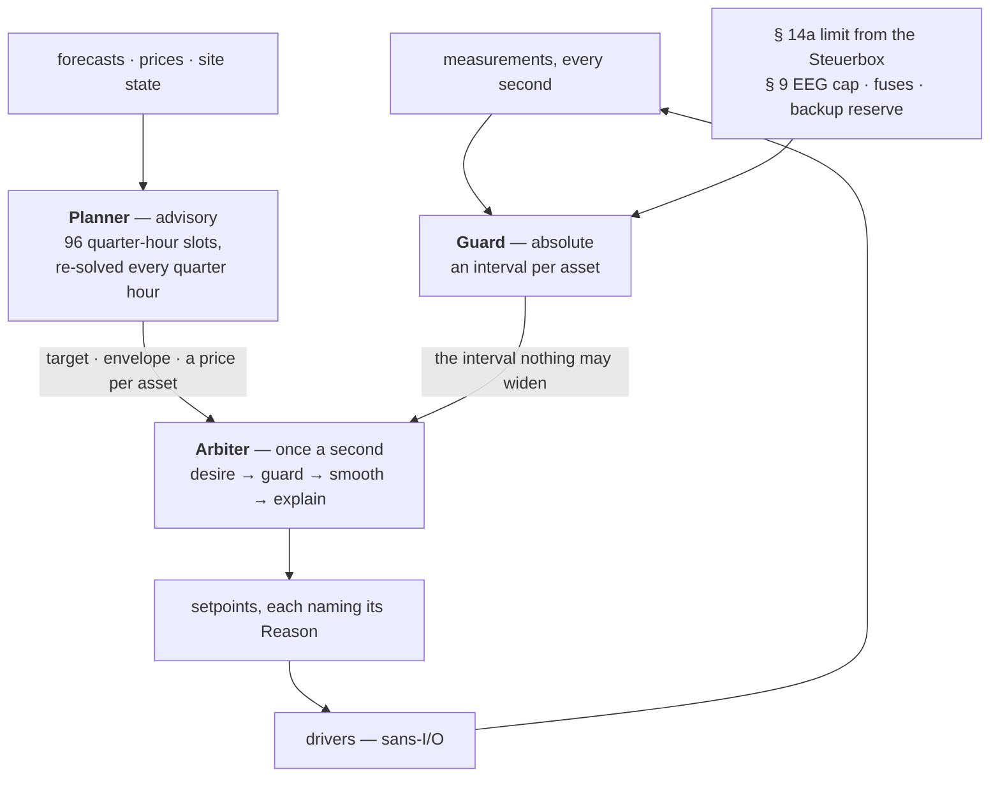

<h1 align="center">⚡ hems</h1>

<p align="center">
  <strong>The open-source home energy management platform for the German market.</strong><br>
  Grid rules that are executable and cited. A guard the optimiser cannot argue with. Everything sans-I/O.
</p>

<p align="center">
  <a href="https://hupe1980.github.io/hems"></a>
  <a href="https://github.com/hupe1980/hems/actions/workflows/ci.yml"></a>
  <a href="#-licence"></a>
  
  
</p>

---

> 🚧 **Pre-alpha.** The control stack is real, tested and simulated end to end.
> Nothing talks to household hardware yet — see [Status](#-status).

A household with a roof, a battery, a car, a heat pump and a hot-water tank is
now a small power station with legal obligations. Since 2024 the network operator
may turn its controllable devices down (§ 14a EnWG); since 2025 new photovoltaics
may feed in only 60 % of their installed power until an intelligent meter arrives
(§ 9 EEG), every supplier has to offer a tariff that changes every quarter hour
(§ 41a EnWG), and — once the smart meter has been in a year — nothing is earned
while the price is negative (§ 51 EEG); from 2026 storage has to account for
where its energy came from (MiSpeL) and neighbours may share electricity
(§ 42c EnWG).

**hems is the energy manager that treats those as computation rather than
paperwork.** Every rule names the document it comes from, is executable, and is
tested against the worked examples in that document.

## 📚 Documentation

The full argument lives at **[hupe1980.github.io/hems](https://hupe1980.github.io/hems)**.
This file is the front door.

| | |
|---|---|
| [Getting started](https://hupe1980.github.io/hems/docs/getting-started/) | clone it, run the checks, watch a January day with a § 14a reduction |
| [Architecture](https://hupe1980.github.io/hems/docs/architecture/) | three control planes, three cadences, one order of authority |
| [The domain model](https://hupe1980.github.io/hems/docs/domain-model/) | one sign convention, the quarter-hour grid, the electrical tree, commands that name a reason |
| [The grid rules](https://hupe1980.github.io/hems/docs/grid-rules/) | § 14a, § 9 EEG, Modul 3, MiSpeL, § 42c — as code, with the citation for every number |
| [Tariffs and prices](https://hupe1980.github.io/hems/docs/tariffs/) | the bill as a stack, the five day-ahead sources, § 51 EEG, the Modul advisor |
| [The planner](https://hupe1980.github.io/hems/docs/optimizer/) | the receding-horizon MILP, and what a kilowatt-hour is worth per device |
| [Forecasting](https://hupe1980.github.io/hems/docs/forecasting/) | what the box believes about tomorrow, and what being wrong costs |
| [Flexibility](https://hupe1980.github.io/hems/docs/flexibility/) | S2 / EN 50491-12-2 as the internal model |
| [Devices and drivers](https://hupe1980.github.io/hems/docs/devices/) | amperes, contact states, contactors — and the sans-I/O driver contract |
| [Simulation](https://hupe1980.github.io/hems/docs/simulation/) | seven reference days, simulators that say no, and the sweeps a single day cannot replace |
| [The fleet](https://hupe1980.github.io/hems/docs/services/) | five daemons around one box, and why none of them is a trust anchor |
| [Security](https://hupe1980.github.io/hems/docs/security/) | a key the box was built with, secrets as references, SBOM and provenance |

## 🚀 Try it

```console
$ git clone https://github.com/hupe1980/hems && cd hems
$ just demo-all    # seven simulated days end to end, and the comparisons worth seeing
$ just ci          # fmt, clippy, purity, tests, guards, licences, docs
$ just fleet-demo  # a box reporting its day into the fleet view
```

Rust 1.94 and [`just`](https://just.systems). Nothing else: the default solver is
pure Rust, so there is no C++ toolchain and no system library to install.

Released builds are on the
[releases page](https://github.com/hupe1980/hems/releases) for
`x86_64-unknown-linux-gnu` and `aarch64-unknown-linux-gnu`, each built natively,
smoke-tested against a simulated day before it ships, and accompanied by a
CycloneDX SBOM, `SHA256SUMS` and a signed build-provenance attestation
(`gh attestation verify hemsd-*.tar.gz --repo hupe1980/hems`). The binary carries
its own dependency list (`cargo auditable`), so `cargo audit bin hemsd` answers
"what is in this thing" from an artefact found in the field.

Or use a crate on its own — they are independent and none of them does any I/O:

```rust
use hems_grid::para14a::{ControlMode, SteuVe, minimum_power};
use hems_core::prelude::{AssetId, Fallgruppe, Power};

let devices = [
    SteuVe { assets: vec![AssetId::new("wallbox")?], fallgruppe: Fallgruppe::Ladepunkt,     power: Power::from_kw(11.0) },
    SteuVe { assets: vec![AssetId::new("battery")?], fallgruppe: Fallgruppe::Stromspeicher, power: Power::from_kw(5.0)  },
];

// 4,2 kW + (2 − 1) × 0,8 × 4,2 kW = 7,56 kW — the floor the network operator
// may not go below, from [BK6-22-300 A1 4.5.2].
assert!((minimum_power(&devices, ControlMode::Ems).kw() - 7.56).abs() < 1e-9);
# Ok::<(), Box<dyn std::error::Error>>(())
```

## 🧭 How it is arranged



Every layer may only **narrow** what the layer above allowed, so “the grid limit
was respected” is a property of the structure rather than a code path somebody
remembered to write — and it is checked as one, over a thousand randomised
households.

## 🏠 One day, end to end

```console
$ cargo run -p hemsd -- simulate --day winter

  2026-01-15 — with a § 14a reduction

  produced                                  8.4 kWh
  household consumption                    11.0 kWh
  charged into the car                     21.7 kWh
  heat pump                                26.1 kWh
  hot water                                 3.1 kWh
  dishwasher                         1.1 kWh, 75 min later
  battery throughput                       15.5 kWh
  imported                                 55.7 kWh
  exported                                  0.3 kWh
  curtailed                                 0.0 kWh
  peak feed-in, per quarter hour     0.12 of 5.88 kW
  self-sufficiency                             13 %
  wallbox on one conductor           0 min (0 switches)

  indoor temperature                 19.9 – 23.1 °C
  outside the comfort band                 0.12 K·h
  hot-water tank, emptiest                24 % full

  roof, as the box learned it        90 % of the model
  production forecast, CRPS          192 W (81 % of 32 lit)
  load forecast, CRPS                18 W (85 % covered)

  electricity bill                          21.08 €
  battery life spent                         0.62 €
  comfort given up                           0.19 €
  borrowed from the stores                   0.14 €
  cost of the day                           22.02 €
  without optimisation                      24.12 €
  saved                                      2.09 €
  …of it on the bill                         3.39 €

  § 14a limit in force                       90 min
  …against a minimum of                     10.5 kW
  …covered by the store                     1.4 kWh
  control events recorded            1 (93 samples)
  self-restraint records                          1
  slowest reaction                   0 s, commanded
  minutes without a plan                          0
  the opening plan expected          20.05 €, off by +1.03
  without an Energy Guard                     3 min
  limit respected throughout                    yes

  described in S2                       6 resources
  dearest asset vs cheapest                      2×
  relief from § 14a was worth            0.00 €/kWh
  Modul 2 pays above                     2417 kWh/a
  …on this day it would have         -3.97 € on the energy
```

Four lines there are not in anybody else's table, and the
[planner page](https://hupe1980.github.io/hems/docs/optimizer/) argues each:

- **without optimisation** — the same day delivering the **same service** with no
  battery, a wallbox that starts on plug-in and ordinary thermostats, against the
  **same weather** and under the **same grid rules**. A saving computed any other
  way flatters itself.
- **saved / …of it on the bill** — €2,09 against €3,39. The saving counts the
  battery life, the comfort and the service the plan spent; the bill is the
  flattering number every other system quotes.
- **…covered by the store** — `[A1 2.3]` in one number: kilowatt-hours the
  battery lent the controllable devices during the reduction, which never crossed
  the connection point.
- **relief from § 14a was worth** — the shadow price of the network operator's own
  ceiling. Zero here, because the store lends the headroom; €3,93/kWh on the same
  evening in a house without one.

The three forecast lines are the evidence for the money lines: the planner is
given only what six weeks of the box's own metering could have taught it, and
`--perfect-foresight` shows what a saving quoted without that measures — **€5,25
against €2,09** on this day.

## 💡 What makes it different

Seven claims, each argued on the site rather than here.

1. **The grid limit is a proven property, not a code path.** `[A1 4.6 S. 3]`
   requires a network operator's reduction to beat market control, so it lives in
   a guard plane the optimiser cannot reach around — checked by a 1000-round
   property test over random households, not by a code path somebody remembered.
   ([architecture](https://hupe1980.github.io/hems/docs/architecture/))
2. **Every cost the optimiser may spend is a cost the report charges** — battery
   wear, comfort, curtailed production, and the service the plan decided not to
   deliver. A plan that leaves the car two kilowatt-hours short buys two
   kilowatt-hours less electricity, and the bill alone would call that a saving.
   ([planner](https://hupe1980.github.io/hems/docs/optimizer/))
3. **The forecast is allowed to be wrong.** The simulated day runs a seeded
   realisation the planner never sees, and every day scores its own forecasts
   beside the money.
   ([forecasting](https://hupe1980.github.io/hems/docs/forecasting/))
4. **It can plan against a distribution rather than a number** — three futures
   from the published band, the first slot decided once and everything after it
   recourse, with the evaluation that can *falsify* it shipped alongside.
   ([planner](https://hupe1980.github.io/hems/docs/optimizer/))
5. **A kilowatt-hour has a price, and it differs per device.** The plan carries
   the dual of each store's own state equation, so "a reduction takes power from
   where it is worth least" is a decision rather than a sentence.
   ([planner](https://hupe1980.github.io/hems/docs/optimizer/))
6. **It runs the house when the cloud is gone.** Guard, arbiter and planner take
   time as a parameter, so a winter day with a § 14a event is a unit test — and a
   device the manager can only *limit* is handed back to its own thermostat
   rather than held at zero.
   ([architecture](https://hupe1980.github.io/hems/docs/architecture/))
7. **Compliance is arithmetic, and it is written down.** MiSpeL's
   Abgrenzungsoption (1)–(33) and Pauschaloption (P1)–(P15), § 42c's quarter-hourly
   allocation, Modul 3 windows and the two years of § 14a evidence — in exact
   decimals, with the Festlegung's own numbering.
   ([grid rules](https://hupe1980.github.io/hems/docs/grid-rules/))

## 📐 What the rules are taken from

Every regulatory number carries the document and clause it comes from —
`[BK6-22-300 A1 4.5.2]`, `[LPC-031]` — and `cargo xtask check-citations` resolves
all 328 of them against an index of primary sources, **failing the build** if one
names a document the index does not carry. `cargo xtask check-wire` does the same
for the 121 quantities and instants, each of which has to say how it travels.

The documents are third-party copyrighted publications and are not redistributed;
the index records the retrieval URL of each.

## 📦 Crates

| Crate | What it is | I/O |
|---|---|---|
| [`hems-core`](crates/hems-core) | Domain model: one sign convention, the quarter-hour grid, assets, circuits, setpoints that must name a reason, the building as an exactly discretised RC model, the hot-water tank as a store, an appliance's programme as the shape it draws | none |
| [`hems-grid`](crates/hems-grid) | § 14a EnWG, the EEBUS LPC/LPP state machine, § 9 EEG, Modul 3, MiSpeL flow bookkeeping, § 42c sharing, the two-year evidence record — all cited, and the ones `metering` owns are called rather than copied | none |
| [`hems-tariff`](crates/hems-tariff) | The price stack; parsers for what ENTSO-E, SMARD, aWATTar, Tibber and Energy-Charts publish; an advisor that compares Modul 1/2/3 against a household's own history | none |
| [`hems-forecast`](crates/hems-forecast) | Solar geometry and a physical photovoltaic model, an online residual corrector that learns what *this* roof delivers, load profiles by day type, charging-session statistics by weekday, RC identification of the building from its own record, naive fallbacks, and the metrics that score all of it | none |
| [`hems-optimizer`](crates/hems-optimizer) | Receding-horizon MILP: cost, wear, comfort, hot water, shiftable appliances placed rather than smeared, grid limits per slot as hard constraints | none |
| [`hems-realtime`](crates/hems-realtime) | The guard plane, fair allocation of a limited budget, the one-second arbiter | none |
| [`hems-device`](crates/hems-device) | What a wanted power becomes on real hardware: amperes, phase counts, SG Ready contacts — and `realisable`, what a semi-continuous device will *actually* take | none |
| [`hems-drv`](crates/hems-drv) | The driver contract — bytes and a clock in, events and bytes out — with SunSpec over Modbus TCP and the EEBUS LPC Controllable System behind features | none |
| [`hems-flex`](crates/hems-flex) | The household's flexibility in S2 (EN 50491-12-2): which control type each asset is, every description a whole site would send — the same wallbox is a store with a car on it and an envelope without one — and what an instruction means | none |
| [`hems-sim`](crates/hems-sim) | Battery, charge point, inverter, building, hot-water tank, a dishwasher that will not be paused, and Steuerbox simulators on virtual time — each with at least one way of saying no — and a seeded weather realisation, so the day that happens is not the day that was forecast | none |
| [`hems-events`](crates/hems-events) | The CloudEvents catalogue, enforced by a workspace guard | none |
| [`hems-service`](crates/hems-service) | The shell every daemon shares: configuration from a file then the environment, a **`Secret`** whose configured value may be an `env:` or `file:` reference rather than the credential itself, **live and ready as separate questions**, a bounded shutdown, and Ed25519 verification of a release *and of the box's own configuration* — whose trust anchor is a key the box was built with, not the server that offered it | tokio, axum |

## 🛰️ Daemons

| Service | What it does | State |
|---|---|---|
| [`hemsd`](services/hemsd) | The house: guard, arbiter, planner and evidence recorder against a simulated site, keeping the household's own two years of § 14a evidence locally with an outbox for the fleet | ⏳ no hardware yet |
| [`tariffd`](services/tariffd) | Fetches the five published day-ahead sources, reconciles a curve that arrives twice under a written trust order, and keeps two days each way so a WAN outage never costs a plan | ✅ |
| [`forecastd`](services/forecastd) | ICON-D2 through Open-Meteo at quarter-hour resolution. Serves the **sky**, never a finished forecast — the correction for *this* roof is the box's, because it is a property of one roof | ✅ |
| [`histd`](services/histd) | The fleet's record: the two years of § 14a evidence `[A1 7.3]`, the quarter-hour registers a settlement is computed from, and both exports — the operator's Nachweis and the household's Data Act Article 4 document, each authorised per site, because Article 4 is a right of the *user* and a fleet token is not a household | ✅ |
| [`fleetd`](services/fleetd) | Single-use enrolment, and **signed** configuration and releases it holds signatures for and never a key — so a `fleetd` an attacker owns can serve neither a configuration nor an update any box will accept | ✅ |
| [`obsd`](services/obsd) | The fleet view: averages what is an average, and **counts** what is a count — every § 14a breach as a named finding, never as a percentage. A day reaches it over TLS and only as a **signed** CloudEvent, because a list of who broke a grid rule that anybody can write to is not evidence | ✅ |

## 📊 Status

**Pre-alpha, and the line is worth being exact about: nothing here talks to
household hardware yet.** `hems-sim` stands in for every device. What is real is
the control stack, the rules and the fleet — and the simulated days run the same
guard, arbiter and planner a box would.

| Works today | |
|---|---|
| The domain model and the German grid rules | § 14a, § 9 EEG, § 51, Modul 3, MiSpeL, § 42c, the two-year evidence record — all cited |
| The guard, the allocator and the one-second arbiter | with the § 14a precedence as a property test over a thousand randomised households |
| The receding-horizon MILP | wear, comfort, hot water, placed appliances, per-slot grid limits, a shadow price per asset, and planning against three futures |
| Forecasting, and being scored on it | solar geometry, a residual corrector that learns *this* roof, CRPS and calibration beside the money |
| Seven reference days end to end | plus multi-day back-test and risk sweeps |
| S2 / EN 50491-12-2 as the internal flexibility model | every message a whole site would send, and a count of what it cannot express |
| The driver contract, SunSpec over Modbus TCP, and the EEBUS LPC Controllable System | sans-I/O; a whole § 14a day in virtual time |
| The driver registry | `hemsd` checks the drivers against the site *before* a byte moves |
| The five fleet daemons | prices and weather fetched, the two years stored, enrolment, signed configuration and releases, a fleet view that will not take an unsigned day |

| Not yet | |
|---|---|
| The event loop that owns real sockets | a task per driver that connects, reads, writes and reconnects, and a site loaded from configuration — **next** |
| SHIP / SPINE under EEBUS | TLS, SKI pairing, a trust store; the conformance harness and an interoperability event |
| The rest of the fleet tier | a household portal, a Postgres-plus-Iceberg store for `histd`, GDPR erasure, A/B images and OTA campaigns |
| The market side | OpenADR 3.1 and § 41e, and the MiSpeL and § 42c *exports* — the arithmetic already ships |
| Controlling devices rather than only being controlled | the EEBUS CEM role, an S2 adapter, V2H/V2G, Matter DEM |

727 tests. `just ci` runs formatting, Clippy with warnings as errors on every
feature combination, a purity check that fails if a domain crate reaches for a
clock, the whole suite, the workspace guards (328 citations across five document
families, each resolving to a document the index carries; 121 quantities,
instants and dates each naming how they travel), `cargo-deny` and the docs.

Three of those tests are worth naming because of what they guard against. One
asserts the reference day's forecasts were **wrong**, since a day the planner
cannot be surprised by measures a planner that was shown the answer. One runs the
day's own quarter-hour registers through the § 42c allocation. One checks that
every asset the arbiter commands can be described in S2. A rule module can be
implemented, cited, tested and reached by nothing at all, and no property test
catches that — a property is a statement about code that runs.

## 🤝 Related crates

hems consumes rather than reimplements: [`s2energy`](https://crates.io/crates/s2energy)
(the S2 / EN 50491-12-2 types, generated from the official schema by the
standard's own authors), [`metering`](https://github.com/hupe1980/metering)
(Europe/Berlin calendar, OBIS, § 14a minimum power and netzwirksamer
Leistungsbezug, Modul 3 calendars and their conformance rules, the VDE-AR-N 4100
Unsymmetrieleistung, the allocation identity § 42b/c settle on), [`eebus`](https://github.com/hupe1980/eebus),
[`ocpp-kit`](https://github.com/hupe1980/ocpp-kit), [`iso15118`](https://github.com/hupe1980/iso15118)
and [`mako`](https://github.com/hupe1980/mako) (the market side).

The embedded time-series store on the box (`chronix`) and the fleet-side one
(`meterstore`) are separate crates hems does not depend on yet: the box keeps its
§ 14a record in an embedded SQLite, and the *measurement series* is what `chronix`
is for. That split is the answer to *what runs where*: the edge is **one**
process, `hemsd`, because the § 14a failsafe is a sixty-second heartbeat and a
two-hour minimum and an IPC hop inside that path buys nothing — so the box's
stores are embedded, and every other daemon in the table above is cloud.

## 📄 Licence

MIT OR Apache-2.0, at your option.

hems is not affiliated with the Bundesnetzagentur, the BDEW, the EEBus Initiative
or the VDE. Regulatory documents are cited, never redistributed.
