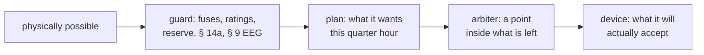

# hems-core

The domain model every other crate in the [hems](https://github.com/hupe1980/hems)
workspace speaks: sites, assets, circuits, the 15-minute Europe/Berlin slot grid,
measurements, and commands that must name their reason.

**Facts, not rules.** What a heat pump *is* lives here; whether it is a
steuerbare Verbrauchseinrichtung under § 14a EnWG lives in `hems-grid`, and the
regulatory vocabulary the two share — `Fallgruppe`, the Bundesland calendar, the
market identifiers — comes from
[`metering`](https://github.com/hupe1980/metering).

- 🧊 **No I/O, no clock, no async** — time is a parameter, so a winter day with a
  DST transition is a unit test.
- ➕ **One sign convention** — positive power flows *into* the thing measured, so
  `grid == Σ assets` holds site-wide and is testable.
- 🧾 **Commands explain themselves** — a `Setpoint` cannot exist without a
  `Reason`, and reasons carry an `Authority` that makes "the grid limit wins" a
  checked property rather than a convention.
- 🏠 **The building is a store** — a two-mass RC model discretised *exactly* by a
  matrix exponential, so the planner, its baseline and the simulator all step the
  same house and none of them can ring or diverge at a quarter-hour step. So is
  the hot-water tank: three hundred litres between 45 and 60 °C are five
  kilowatt-hours of heat that can be bought hours before they are used.
- 🍽️ **A shiftable appliance carries its programme** — `LoadKind::Shiftable`
  holds the `Programme` it will run, quarter hour by quarter hour, so the state
  where a machine announces flexibility and cannot say what shape it takes is not
  representable. And it is a *shape*, not a duration and an average: a dishwasher
  takes two kilowatts to heat and two hundred watts to wash, and a planner handed
  the average schedules a machine that does not exist.
- 🔀 **Wiring and mode are different questions** — `PhaseConnection` is what a
  device is wired to, `PhaseMode` is what it is using right now. Answering the
  second with the first is how an 11 kW wallbox drawing symmetrically on three
  conductors acquires the 4,6 kVA limit a *single-phase* device is allowed.

Every layer hands down an **interval**, and nobody widens one:



An empty interval — `floor > ceiling` — is a real outcome rather than a bug: two
rules that cannot both be satisfied. `Envelope::resolve` keeps the stricter
*ceiling*, because exceeding a grid limit is worse than falling short of a floor.

```rust
use hems_core::prelude::*;

let limit = Setpoint::new(
    AssetId::new("wallbox-garage")?,
    Command::ConsumptionCeiling(Power::from_kw(4.2)),
    Reason::guard(GuardRule::Lpc),
    time::macros::datetime!(2026-01-15 17:04:00 UTC),
)?;
assert_eq!(limit.authority(), Authority::Guard);
# Ok::<(), Box<dyn std::error::Error>>(())
```

## License

MIT OR Apache-2.0
