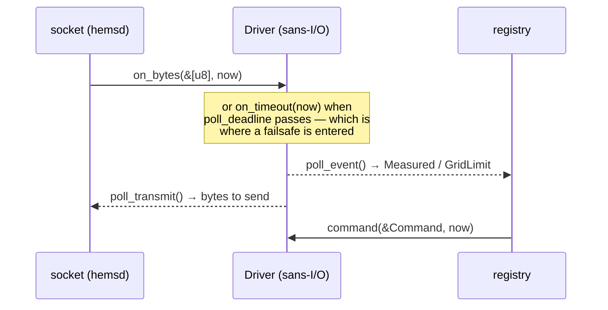

# hems-drv

Drivers for [hems](https://github.com/hupe1980/hems): **bytes and a clock in,
events and bytes out**, and no I/O anywhere.

A driver is the only part of the workspace that knows a protocol. It is also the
part most likely to be written by somebody who has never read the rest of it,
against a device that behaves badly, in a hurry. So the contract is narrow on
purpose.

- 🧊 **Sans-I/O.** No socket, no thread, no clock. A driver is handed the bytes
  that arrived and the time it is now, and answers with what it would like to
  send and when it would like to be woken. `hemsd` owns the socket.

  That is not a style preference. The § 14a failsafe is a sixty-second heartbeat
  and a two-hour minimum: a driver that read a clock could only be tested by
  waiting. Passing time as a parameter makes *"the Steuerbox goes quiet at 17:04
  and comes back at 19:11"* an ordinary assertion — and `just purity` fails the
  build if this crate reaches for a clock, the filesystem or the network.

- 🔌 **Two kinds of driver, one trait.** A **device** driver speaks to something
  the household owns and reports measurements; a **grid** driver speaks to
  something the network operator owns and reports limits. A household does not
  command its own reduction, so a grid driver accepts nothing.

- 🚦 **A driver reports; it does not decide.** What the site may do is
  `hems-realtime`'s decision, made with every asset in view. A driver that
  computed its own limit would be a second control plane nobody audited.

- ⏳ **And whether silence means anything.** A driver that polls reads every
  second, so a reading older than a few of those means the device stopped
  answering. One whose values are notified on change is silent exactly while
  nothing happens — a tank holding 52 °C, a room holding 21 °C — and judging it
  the same way drops it from the site's state seconds after every reading.
  Drivers declare `reports_on_change`, and the declaration is held to the
  specification's own scenario tables by a test.

- 🏷️ **Quality is the driver's to set.** It is the only thing in the workspace
  that knows whether the number it holds came off the wire this second or is the
  last one it saw before the device went quiet — a distinction no layer above can
  recover, because both arrive as the same `f64`.

- ☀️ **Available power is declared, not assumed.** A curtailed inverter asked
  what it is producing answers with what the manager already commanded, so a
  controller reading that alone never lifts its own curtailment. Drivers say
  whether they can publish the real figure, and a household is entitled to know
  which of the two its box is running on.

## The protocols, behind features

### `eebus` — the network operator, and the household's own devices

Two directions, and the distinction is the whole shape of the feature. Under
§ 14a the operator's Steuerbox dials **this** box, so hems listens; a heat pump
or a hot-water circuit is a device on the household's own network, so hems
dials. The datagram pump above the handshake is the same either way.

**Toward the operator** — the *Controllable System* of Limitation of Power
Consumption. The five-state limitation machine, the 120-second heartbeat
timeout, the 2–24 hour `FailsafeDurationMinimum`, the rule that an expired
duration deactivates a limit: all of it lives in the
[`eebus`](https://crates.io/crates/eebus) crate, sans-I/O and tested against the
use-case specification. This is a *translation*, and `hems-grid`'s `LpcState` is
**derived** from `eebus`'s rather than tracked beside it — two implementations
of a certifiable state machine disagree, and the one that is wrong is whichever
the certification lab is not looking at.

A whole LPC day runs in virtual time: a reduction, its own expiry, heartbeat
loss, the failsafe and the release. An operator's limit and a household
restraining itself because nobody is talking to it are reported as **different
events**, because they are different things in the evidence record of
`[A1 7.2]`. Beside it, MGCP gives the connection point's own power and the § 9
EEG feed-in factor.

**Toward the household**, one driver per *appliance* rather than per use case —
SHIP grants one session per peer pair, so two drivers dialling one heat pump
would be two connections to a device that allows one:

| Driver | Use cases | What it is for |
|---|---|---|
| `eebus_heat_pump` | OHPCF, MRT, MOT | starts and stops the compressor's process — the one use case that can ask an appliance to consume *more* — and reports the air temperature of each room it watches and the weather at this building |
| `eebus_dhw` | MDT, CDSF | how warm the tank is, and a one-time hot-water loading: the button in the bathroom, pressed over the wire |
| `eebus_ev` | EVCC, EVSOC | whether there is a car on the cable and how full it is. It reads and never commands — the charge point is already commanded |

An **arrival has no message**: an `EV` entity appearing under the `EVSE` *is*
how EVCC says a cable went in, so the fact lives in SPINE's discovery rather
than in a payload.

### `modbus` — SunSpec, and the maps that are not

Inverters, meters and batteries over **SunSpec**, the one protocol that needs no
membership, no registration and no certificate.

Those register maps are **not** ours: SunSpec is a thousand pages of model
definitions and the [`sunspec`](https://crates.io/crates/sunspec) crate carries
them as generated types. What is here is the framing, the walk that finds the
models on a *particular* device (where model 103 lives differs between firmware
versions of the same inverter), and the honesty about what the protocol cannot
say. Model **701** is the interesting one: `ThrotPct` is how much throttling is
in effect, so `W / (1 − ThrotPct)` recovers what the array would deliver
unthrottled. A device that publishes it reports available power; one that does
not, says so.

`modbus::registers` is the other half of the market — everything that answers
Modbus and publishes no model list, which is most of the installed heat-pump
base, where the numbers are in a PDF and every unit's differ. A point declares
its register **space**, width and **word order**, scale and field, and guesses
none of them: holding and input registers are separately addressed, and 1,8 kW
read with the words the other way round is 117 964 800 W.

It writes only what a household **declares**, in a list of its own, and only the
values that declaration enumerates — one sixteen-bit holding register each, so
nothing is computed from a scale. A map with no `writes` is read-only, because a
map that could write anything is one where a typo in a configuration file starts
a compressor. The command that needs it is a reversible heat pump's
**direction**, which no EEBUS use case carries.

## One crate, not one per protocol

All of this together is about five thousand lines, over half of it commentary.
`hems-grid` alone is six and a half thousand and `hems-device` is eight hundred
as a *single* crate, so a crate per protocol would be ceremony — and the standing rule in this workspace is that
machinery has to be earned. The *trait* is, by two implementors of genuinely
different shapes; a crate each is not.

The isolation a crate each would buy is bought by `optional = true` instead: a
box built with `--features modbus` never compiles, audits or ships the EEBUS
stack. What one crate adds is that the feature matrix lives in one manifest.

## License

MIT OR Apache-2.0
