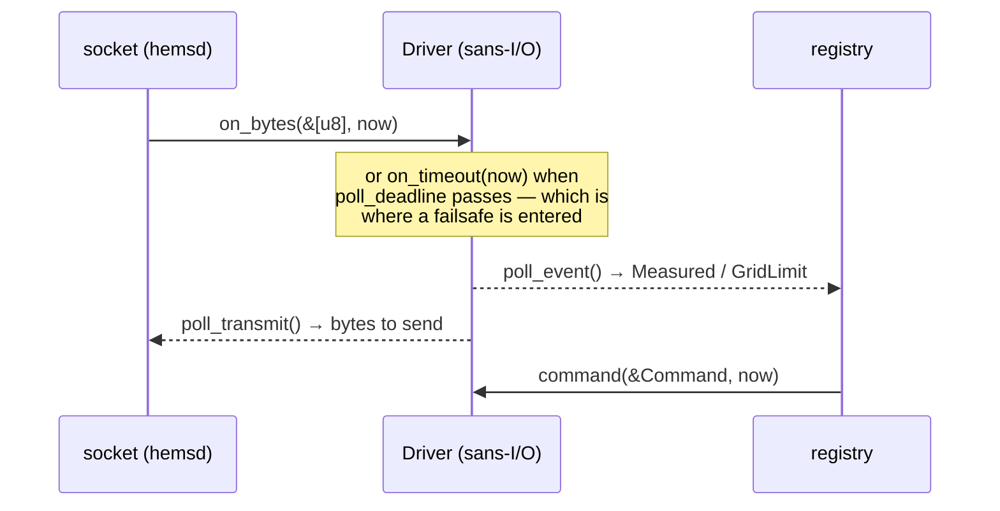

# hems-drv

Drivers for [hems](https://github.com/hupe1980/hems): **bytes and a clock in,
events and bytes out**, and no I/O anywhere.

A driver is the only part of the workspace that knows a protocol. It is also the
part most likely to be written by somebody who has never read the rest of it,
against a device that behaves badly, in a hurry. So the contract is narrow on
purpose.

- 🧊 **Sans-I/O.** No socket, no thread, no clock. A driver is handed the bytes
  that arrived and the time it is now, and answers with what it would like to
  send and when it would like to be woken. `hemsd` owns the socket.

  That is not a style preference. The § 14a failsafe is a sixty-second heartbeat
  and a two-hour minimum: a driver that read a clock could only be tested by
  waiting. Passing time as a parameter makes *"the Steuerbox goes quiet at 17:04
  and comes back at 19:11"* an ordinary assertion — and `just purity` fails the
  build if this crate reaches for a clock, the filesystem or the network.

- 🔌 **Two kinds of driver, one trait.** A **device** driver speaks to something
  the household owns and reports measurements; a **grid** driver speaks to
  something the network operator owns and reports limits. A household does not
  command its own reduction, so a grid driver accepts nothing.

- 🚦 **A driver reports; it does not decide.** What the site may do is
  `hems-realtime`'s decision, made with every asset in view. A driver that
  computed its own limit would be a second control plane nobody audited.

- 🏷️ **Quality is the driver's to set.** It is the only thing in the workspace
  that knows whether the number it holds came off the wire this second or is the
  last one it saw before the device went quiet — a distinction no layer above can
  recover, because both arrive as the same `f64`.

- ☀️ **Available power is declared, not assumed.** A curtailed inverter asked
  what it is producing answers with what the manager already commanded, so a
  controller reading that alone never lifts its own curtailment. Drivers say
  whether they can publish the real figure, and a household is entitled to know
  which of the two its box is running on.

## The protocols, behind features

### `eebus` — the § 14a side

The **Controllable System** of *Limitation of Power Consumption*: the role a
household energy manager plays toward the network operator's Steuerbox.

The five-state limitation machine, the 120-second heartbeat timeout, the 2–24
hour `FailsafeDurationMinimum`, the rule that an expired duration deactivates a
limit — all of it lives in the [`eebus`](https://crates.io/crates/eebus) crate,
sans-I/O, tested against the use-case specification. This is a *translation*, and
`hems-grid`'s `LpcState` is **derived** from `eebus`'s rather than tracked beside
it: two implementations of a certifiable state machine disagree, and the one that
is wrong is whichever the certification lab is not looking at.

A whole LPC day runs in virtual time — a reduction, its own expiry, heartbeat
loss, the failsafe and the release. An operator's limit and a household
restraining itself because nobody is talking to it are reported as **different
events**, because they are different things in the evidence record of `[A1 7.2]`.

*Not yet:* the SHIP session and the SPINE datagrams that carry a write from a
real Steuerbox.

### `modbus` — SunSpec over Modbus TCP

Inverters, meters and batteries, over the one protocol that needs no membership,
no registration and no certificate.

The register maps are **not** ours: SunSpec is a thousand pages of model
definitions and the [`sunspec`](https://crates.io/crates/sunspec) crate carries
them as generated types. What is here is the framing, the walk that finds the
models on a *particular* device (where model 103 lives differs between firmware
versions of the same inverter), and the honesty about what the protocol cannot
say.

Model **701** is the interesting one: `ThrotPct` is how much throttling is in
effect, so `W / (1 − ThrotPct)` recovers what the array would deliver
unthrottled. A device that publishes it reports available power; one that does
not, says so.

## One crate, not one per protocol

All of this together is about two thousand lines. `hems-grid` alone is five
thousand and `hems-device` is eight hundred as a *single* crate, so three crates
for this would be ceremony — and the standing rule in this workspace is that
machinery has to be earned. The *trait* is, by two implementors of genuinely
different shapes; a crate each is not.

The isolation a crate each would buy is bought by `optional = true` instead: a
box built with `--features modbus` never compiles, audits or ships the EEBUS
stack. What one crate adds is that the feature matrix lives in one manifest.

## License

MIT OR Apache-2.0
