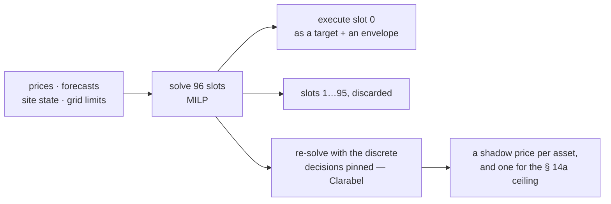

# hems-optimizer

The planner of [hems](https://github.com/hupe1980/hems): a receding-horizon
mixed-integer linear program over quarter-hour slots that **prices battery wear
instead of hiding it**.

A cost-only planner cycles a battery for a spread that does not cover the damage;
measured, the hidden degradation can exceed the energy saving by an order of
magnitude. hems charges throughput in euros per kilowatt-hour, half on each leg,
so a full cycle pays it once.

Only the **first slot** is ever executed; everything after it exists to price the
consequences of that slot. Several decisions below turn out the way they do
because of it.

- 💶 **One currency.** Carbon (€/kg), self-sufficiency (€/kWh imported), comfort
  (€ per kelvin-hour) and curtailment are *prices*, so the terms can honestly be
  added up. An objective that swapped the energy price for grams of CO₂ while
  leaving wear in euros would be minimising a sum of two currencies.
- 🔌 **A charge point is off, or above 6 A.** Semi-continuous, because below the
  minimum of IEC 61851 a wallbox is not charging slowly — it is idle, and a plan
  that trickles 500 W into it delivers nothing.
- 🏠 **The building is a battery.** A 2R2C thermal model with a priced comfort
  band and its own terminal value; the fabric usually stores several times what
  the household battery does, and it is free.
- 🚿 **So is the hot water.** A linear store — heat above the lowest acceptable
  temperature, with a leak and a draw, which is S2's own view of a tank — and a
  cold shower is priced rather than forbidden, for the same reason the charging
  deadline is.
- 🍽️ **A dishwasher is placed, not spread.** One binary per *feasible* start, and
  the programme's own shape — two kilowatts to heat, two hundred watts to wash,
  two kilowatts to dry. A planner given the average schedules seven hundred watts
  of dishwasher into every sunny slot, which no dishwasher will carry out. Not
  running it is soft and priced, like every other deadline here.
- 🎲 **The forecast is a distribution, not a number.** `Risk` reads the band the
  forecast already publishes as **three futures** (Swanson's 0,3 / 0,4 / 0,3),
  paired so the pessimistic one is dull *and* hungry; the first slot is decided
  once and everything after it is recourse; a **CVaR** tail is linearised exactly
  (Rockafellar–Uryasev). And the duals still come from a risk-neutral re-solve,
  because a price is a question about money.

  The unusual part is that the evaluation which can *falsify* it ships too: a
  single simulated day pays a hedge's premium every time and makes its claim
  never. `hemsd risk`, over twenty seeded weathers on each of two days, says scenarios
  are worth about €0,15 a day where a service is at risk — and take the
  undelivered charge from €0,07 to €0,01 — cost about €1,04 a day where nothing
  is, and that **no** policy improves the worst day. So the default is one
  median.
- ❄️ **A compressor's minimum runtime remembers the compressor.** The rows that
  state it constrain a *transition*, so each needs the slot before it — and none
  of them says anything about slot 0, which is the only slot a receding horizon
  executes. So a box could start the unit, commit that quarter hour, re-plan
  against a model with no memory, and stop it again, for ever, with every
  individual plan feasible. `CompressorState` makes `on[−1]` a fact, and the
  slots the unit still owes are pinned rather than branched; anchoring the first
  transition also took a 96-slot heating day from 5,0 s to about 1,0 s.
- 🚫 **A plan whose inputs do not describe its horizon is refused.** Reading a
  slot with no band as zero says the roof is dark *and* the house is empty, wrong
  in both directions at once; a price stack indexed by position without checking
  its hours optimises somebody else's day. Both are errors rather than confident,
  ordinary-looking plans.
- ⚖️ **Grid rules are hard constraints, per slot** — § 14a on the netzwirksamer
  Leistungsbezug (a discharging store raises it; a ninety-minute reduction is not
  an all-day one), § 9 EEG on feed-in, the connection on import.
- 📉 **An honest baseline.** The plan reports its cost *and* what the same
  horizon costs delivering the same service with none of the decisions, so a
  saving is a subtraction rather than a claim.
- 💰 **A shadow price per asset, and one for the network operator's limit.** A
  mixed-integer program has no duals, so the model is solved a second time with
  the discrete decisions pinned; the dual of each store's own state equation *is*
  what a kilowatt-hour held there is worth to this household, with the departure
  time, the comfort band, the wear and tomorrow's reduction already in it. That
  is what weights the guard's allocation — one marginal value per *slot* weights
  nothing. The dual of the § 14a ceiling comes with it, and it is the honest
  answer to "what is your flexibility worth": €3,93/kWh on a household whose car
  will otherwise leave short, €0,16 on the same one with a battery to lend it
  headroom.
- ⚙️ `good_lp` behind `microlp` (default, pure Rust — no C++ toolchain) or
  `highs` (production), with a relative gap and a time budget. The **dual pass
  always runs on Clarabel**, which is also pure Rust, so there is no backend
  split: a plan does not mean different things on two builds of the same
  software.

Two things a model has to get right for a dual to mean anything, and neither can
fail a test of the primal. **No redundant row may be left in it**: `g⁺ ≤ load +
b⁺ + ev + h + w` is implied by the energy balance, so it constrains nothing — and
it is tight whenever the household is not exporting, which gives it a free dual
that absorbs the energy balance's and makes the price of a kilowatt-hour
*indeterminate*. And **conditioning**: watts against euros is a 10⁸ condition
number, which simplex never notices because it only compares coefficients with
each other, and which an interior-point method faithfully returns as noise.

## License

MIT OR Apache-2.0
