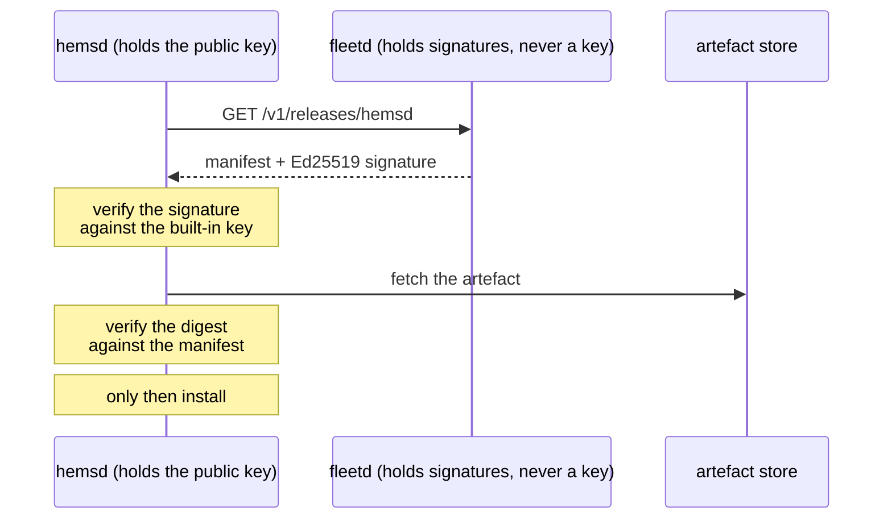

# fleetd

Adopting a box, telling it what to run, and offering it updates — for
[hems](https://github.com/hupe1980/hems).

Three jobs, and the third has a security argument behind it.

## Enrolment

A box arrives holding an **enrolment secret** an installer put on it, and leaves
holding a long-lived credential of its own. The secret is **single-use**: a second
attempt with the same one is refused, because an enrolment secret that still
works after the box is in the field is a credential sitting in an installer's
notes.

## Configuration

Versioned, and the box reports which version it is **running**. That is the half
usually missing: a fleet that can only *push* configuration cannot answer “how
many of my boxes actually took the change”, which is the question asked the
morning after a rollout.

## Updates, and why the server is not the trust anchor

`fleetd` publishes a manifest and an Ed25519 signature over it, and **never holds
the signing key**. A compromised `fleetd` can therefore serve a manifest no box
will accept, which is what makes the fleet server ordinary infrastructure rather
than the root of trust.

That is the Cyber Resilience Act's integrity requirement (Regulation (EU)
2024/2847, Annex I Part I § 2(c)) implemented rather than asserted — the
difference between “we use HTTPS” and “the update is signed”.

The same argument applies to the **configuration**: it decides which assets the
site has, what the comfort band is and where the box reports, so it is signed by
the same built-in key. Otherwise every sentence above would be a sentence about
the update channel only.

| | |
|---|---|
| `POST /v1/enrol` | single-use enrolment |
| `GET /v1/config` | the signed configuration for this box |
| `POST /v1/config/running` | which version it is actually running |
| `GET /v1/releases/{component}` | a signed release manifest |
| `GET /v1/fleet` | what the fleet is enrolled on |

## License

MIT OR Apache-2.0
