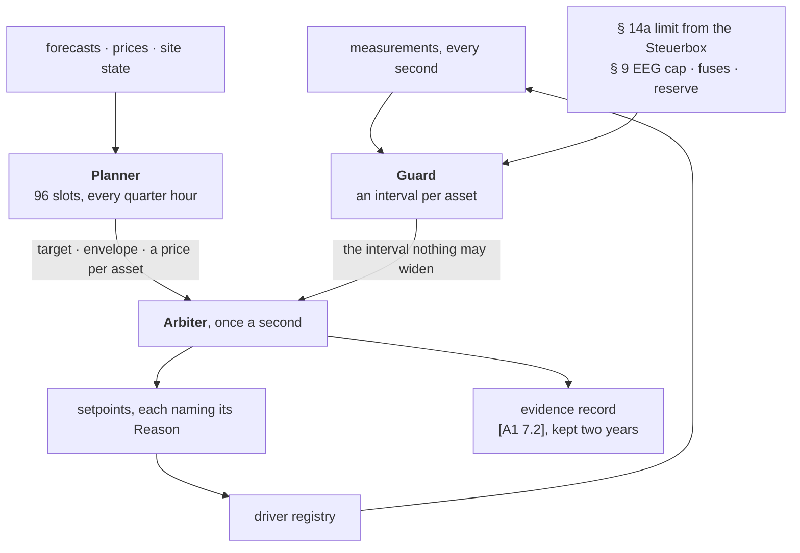

# hemsd

The [hems](https://github.com/hupe1980/hems) edge daemon: the process that runs
on the box in the house.

It is **one** process on purpose. The § 14a failsafe is a sixty-second heartbeat
and a two-hour minimum, and an IPC hop inside that path buys nothing — so the
guard, the arbiter, the planner, the drivers, the evidence recorder and the box's
own stores all live here, and every other daemon in the workspace is cloud.



## What it can do today

Nothing here talks to household hardware yet: `hems-sim` stands in for every
device, and the drivers are sans-I/O and driven by the registry rather than by a
socket. What is real is the control stack — the same guard, arbiter and planner a
box would run.

```console
$ cargo run -p hemsd -- simulate --day winter
```

One simulated day, end to end, in seconds. `--json` for a machine, and:

| Flag | What it does |
|---|---|
| `--perfect-foresight` | hand the planner the exact series the simulator is about to run. A comparison, never a default: any saving quoted from it is an upper bound no box in a real house can reach |
| `--wear-eur-per-kwh 0` | reproduce a cost-only optimiser |
| `--no-phase-switching` | wire the charge point to three fixed conductors |
| `--imsys` | run as though an intelligent metering system with a control device were in operation, which lifts the § 9 Abs. 2 EEG 60 % cap |
| `--heat-pump-on-off` | a single-speed compressor rather than a modulating one — the only configuration in which a minimum runtime constrains anything |
| `--uniform-weights` | give every asset the same allocation weight |
| `--sharing` | put the household in a § 42c energy-sharing community |
| `--risk` | how the planner treats the fact that its forecasts are wrong |
| `--store <path>` | keep the day's § 14a evidence and quarter-hour registers in the box's own database |
| `--report-to <url>` | report the day to an `obsd` as a **signed** CloudEvent |

Two more subcommands answer questions a single day cannot:

```console
$ cargo run --release -p hemsd -- backtest --day summer --days 20   # is the band the width it claims?
$ cargo run --release -p hemsd -- risk --day deadline --days 20     # what does hedging cost, and buy?
```

Forecast error is correlated across a day, so ninety-six quarter hours of one
Tuesday are close to one draw; and a single realisation pays a hedge's premium
every time and makes its claim never. Both are minutes rather than seconds, which
is why neither is in CI.

## The registry is a check, not a formality

`hemsd` owns the set of drivers, gives each one its bytes, and folds what they say
into the two things the control planes read. Registration refuses four mismatches
that would otherwise be found months later by a limit that never arrived: a
driver for an asset the site does not have, two drivers for one asset, a
controllable asset whose driver cannot command it, and a § 14a household with
nothing that could hear a reduction.

## The record is written first

`[A1 7.3]` keeps a control event for two years. The box holds its **own** copy in
an embedded SQLite and forwards second, with an outbox column — so what the fleet
has not acknowledged is a backlog rather than a gap. A record that exists only
once it has been uploaded is an intention with a network dependency, and the day
a network operator asks about is the day the link was down.

See the [architecture](https://hupe1980.github.io/hems/docs/architecture/) and
[simulation](https://hupe1980.github.io/hems/docs/simulation/) pages.

## License

MIT OR Apache-2.0
